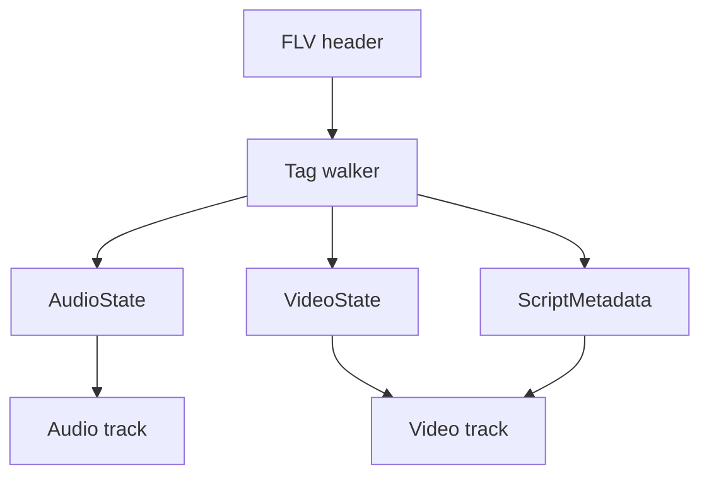

# FLV Parser

Implementation progress: 82%

## Purpose

The FLV parser recognises Flash Video files, reads tag headers, extracts script metadata, and reports audio/video tracks for supported FLV codecs.

## Implementation

- Primary implementation: `src-tauri/src/media_metadata/flv/reader.rs`
- Related modules: `src-tauri/src/media_metadata/flv/header.rs`, `tag.rs`, `script_data.rs`
- Upstream basis: `../mkvtoolnix/src/input/r_flv.cpp`, `../mkvtoolnix/src/input/r_flv.h`, upstream AMF helpers

The parser validates the FLV header, walks tags in a bounded region, skips encrypted tags, decodes AMF0 `onMetaData` values for width, height, and frame rate, and parses AAC, MP3, H.264, H.265, Sorenson H.263, VP6, and VP6-alpha metadata.

## Data Structures

Key structures are `FlvHeader`, `FlvTagHeader`, `AudioTagFlags`, `VideoCodecId`, `ScriptMetadata`, and internal audio/video state.

## Gaps and Handling

Rust extracts selected AMF fields and does not perform timestamp/min-offset work or packet muxing. It may lack upstream's default 25 fps fallback when video headers do not carry timing. Unsupported Screen video codecs are dropped like upstream, and encrypted payloads are skipped rather than parsed.
