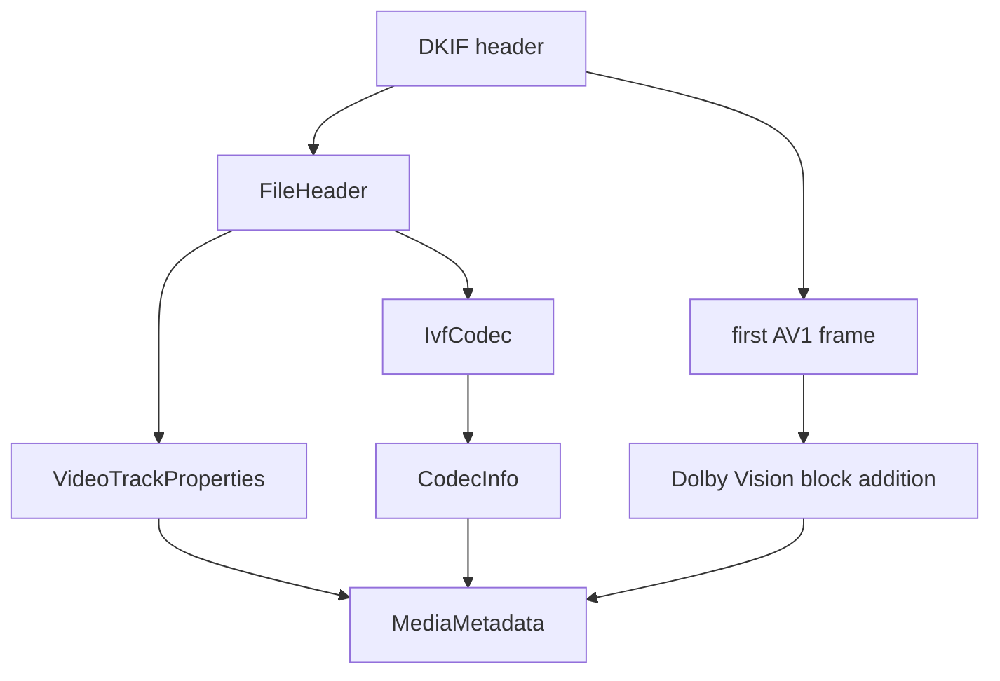

# IVF Parser

Implementation progress: 96%

## Purpose

The IVF parser recognises IVF files containing VP8, VP9, or AV1 and reports one video track with dimensions, frame-rate-derived default duration, and codec identity. For AV1, it can also extract Dolby Vision RPU hints from the first frame.

## Implementation

- Primary implementation: `src-tauri/src/media_metadata/ivf.rs`
- Upstream basis: `../mkvtoolnix/src/input/r_ivf.cpp`, `../mkvtoolnix/src/input/r_ivf.h`, `../mkvtoolnix/src/common/ivf.cpp`, `../mkvtoolnix/src/common/ivf.h`

The parser parses the `DKIF` header, version, header length, FourCC, width, height, frame-rate numerator/denominator, and frame count. It accepts AV1, VP8, and VP9, derives default duration, and reads the first AV1 frame for Dolby Vision RPU metadata.

The probe mirrors `ivf_reader_c::probe_file` (`r_ivf.cpp:30-40`): it claims any file whose 32-byte header carries the `DKIF` magic and a supported codec FourCC, regardless of dimensions or frame rate. `read_headers` then mirrors `m_ok = width && height && frame_rate_num && frame_rate_den` (`r_ivf.cpp:50`): a claimed file whose dimensions or frame rate are zero still identifies the container (`recognized`/`supported`), but contributes no track — matching upstream, where `add_available_track_ids` and `create_packetizer` both gate on `m_ok`.

## Data Structures

Key structures are `FileHeader`, `IvfCodec`, and the internal Dolby Vision config helpers.

## Gaps and Handling

Upstream frame payload handling and keyframe logic are muxing concerns and are not implemented. For identify metadata, the parser is otherwise close to upstream and adds a bounded AV1 Dolby Vision extraction path.
