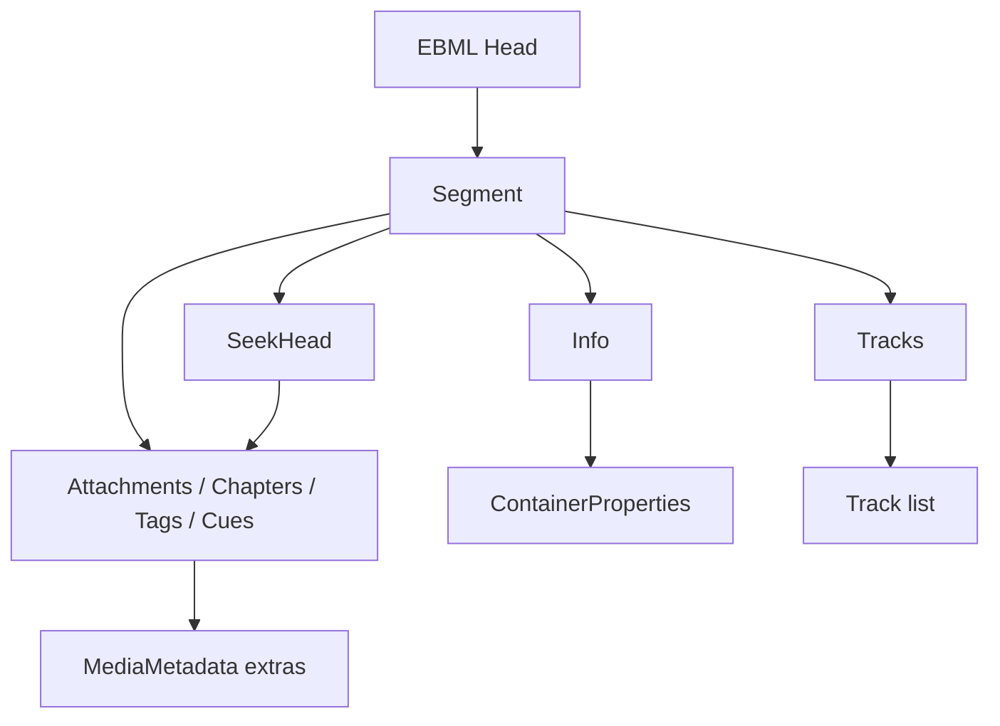

# Matroska / WebM Parser

Implementation progress: 89%

## Purpose

The Matroska parser recognises Matroska and WebM EBML documents and extracts header-level metadata: segment info, tracks, attachments, chapters, tags, cues, and early cluster timestamp hints.

## Implementation

- Primary implementation: `src-tauri/src/media_metadata/matroska/reader.rs`
- Related modules: `src-tauri/src/media_metadata/matroska/ebml.rs`, `info.rs`, `tracks/`, `attachments.rs`, `chapters.rs`, `tags.rs`, `cues.rs`, `seek_head.rs`, `tail_analyzer.rs`, `cluster_timestamps.rs`
- Upstream basis: `../mkvtoolnix/src/input/r_matroska.cpp`, `../mkvtoolnix/src/input/r_matroska.h`

The Rust reader is a pure-Rust EBML walker. It probes the EBML header and Matroska/WebM doc type, locates `Segment`, processes level-1 elements, follows chained `SeekHead` entries, and falls back to a tail scan for deferred metadata. Cluster payloads are not demuxed, but the parser samples opening cluster timestamps to improve track timing metadata.

Attachment parsing keeps a reader-level attachment counter across all `Attachments` level-1 elements. Every `AttachedFile` consumes an ID before filtering for data, MIME type, or other skip conditions, matching mkvtoolnix's `m_attachment_id` bookkeeping; emitted `ui_id` values therefore preserve gaps caused by skipped attachments even across multiple `Attachments` elements.

## Data Structures

Key structures are EBML `ElementHeader`, deferred level-1 position records, track builders under `tracks/`, and the shared `MediaMetadata` model.

## Gaps and Handling

Upstream uses libebml/libmatroska and performs full packetizer checks, content decoding, and cluster processing for muxing. Rust is header-only and does not validate every obscure codec or content-encoding path. Unsupported or unknown details are preserved as structured codec IDs, codec-private blobs, warnings, or omitted fields rather than triggering packetizer-level behavior.

`BlockAdditionMapping` carries the full `block_addition_mapping_t` shape: `BlockAddIDType` (rendered as the source FOURCC when printable, else decimal), `BlockAddIDExtraData` (hex-encoded as `dataHex`), `BlockAddIDName` (`idName`), and `BlockAddIDValue` (`idValue`). Mappings keyed by value or carrying a descriptive name therefore preserve that information on the wire model.

## Open Issues

### PARSER-318: Unknown numeric video enum values are rewritten to defaults

Matroska `VideoColourRange` and `VideoProjectionType` are stored by mkvtoolnix as optional unsigned integers and emitted through identify as numeric fields (`color_range`, `projection_type`). The native parser converts `VideoColourRange` into the `ColorRange` enum and maps unknown values to `Unspecified`; it converts `VideoProjectionType` into the `ProjectionType` enum and maps unknown values to `Rectangular`. The public model does not retain the raw numeric value.

Impact: reserved or future Matroska values are not preserved. They are silently changed into valid default meanings, which changes the file's header data instead of reporting what was present.

### PARSER-319: Video projection and colour binary payloads are rejected by local caps

`VideoColourSpace` is read with a 16-byte cap and `VideoProjectionPrivate` with a 4 KiB cap; `ebml::read_binary` turns any larger element into `ParseError::OversizedElement`. mkvtoolnix clones `KaxVideoColourSpace` and `KaxVideoProjectionPrivate` from libmatroska with their element sizes and reports/preserves those bytes without these local caps.

Impact: valid or mkvtoolnix-accepted Matroska headers can be rejected before metadata is produced, especially projection-private payloads for mesh projection. The header-only parser still needs a global safety bound, but it should not add small element-specific limits that drop bytes mkvtoolnix carries.
