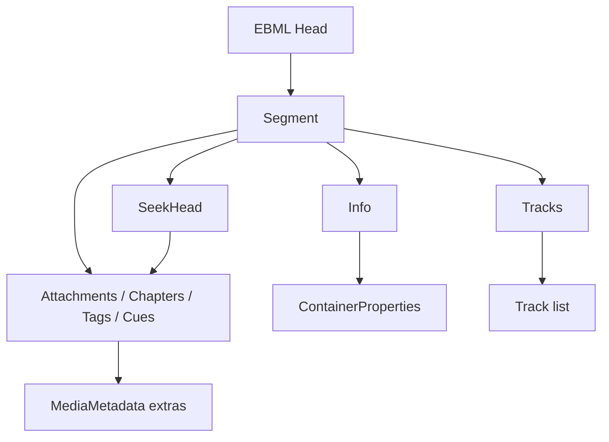

# Matroska / WebM Parser

Implementation progress: 86%

## Purpose

The Matroska parser recognises Matroska and WebM EBML documents and extracts header-level metadata: segment info, tracks, attachments, chapters, tags, cues, and early cluster timestamp hints.

## Implementation

- Primary implementation: `src-tauri/src/media_metadata/matroska/reader.rs`
- Related modules: `src-tauri/src/media_metadata/matroska/ebml.rs`, `info.rs`, `tracks/`, `attachments.rs`, `chapters.rs`, `tags.rs`, `cues.rs`, `seek_head.rs`, `tail_analyzer.rs`, `cluster_timestamps.rs`
- Upstream basis: `../mkvtoolnix/src/input/r_matroska.cpp`, `../mkvtoolnix/src/input/r_matroska.h`

The Rust reader is a pure-Rust EBML walker. It probes the EBML header and Matroska/WebM doc type, locates `Segment`, processes level-1 elements, follows chained `SeekHead` entries, and falls back to a tail scan for deferred metadata. Cluster payloads are not demuxed, but the parser samples opening cluster timestamps to improve track timing metadata.

## Data Structures

Key structures are EBML `ElementHeader`, deferred level-1 position records, track builders under `tracks/`, and the shared `MediaMetadata` model.

## Gaps and Handling

Upstream uses libebml/libmatroska and performs full packetizer checks, content decoding, and cluster processing for muxing. Rust is header-only and does not validate every obscure codec or content-encoding path. Unsupported or unknown details are preserved as structured codec IDs, codec-private blobs, warnings, or omitted fields rather than triggering packetizer-level behavior.

## Open Issues

- `PARSER-228`: `BlockAdditionMapping` is parsed with `BlockAddIDName`, `BlockAddIDValue`, `BlockAddIDType`, and `BlockAddIDExtraData`, but the shared model only exposes `id_type` and `data_hex`. mkvmerge keeps name and value too; mappings that rely on `BlockAddIDValue` or carry a useful name lose that information in native metadata.
