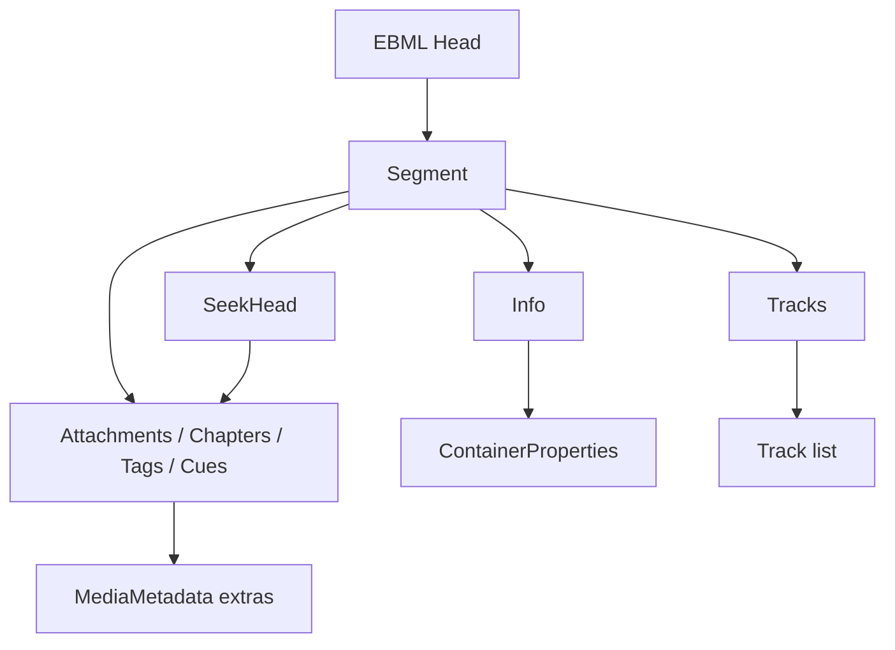

# Matroska / WebM Parser

Implementation progress: 88%

## Purpose

The Matroska parser recognises Matroska and WebM EBML documents and extracts header-level metadata: segment info, tracks, attachments, chapters, tags, cues, and early cluster timestamp hints.

## Implementation

- Primary implementation: `src-tauri/src/media_metadata/matroska/reader.rs`
- Related modules: `src-tauri/src/media_metadata/matroska/ebml.rs`, `info.rs`, `tracks/`, `attachments.rs`, `chapters.rs`, `tags.rs`, `cues.rs`, `seek_head.rs`, `tail_analyzer.rs`, `cluster_timestamps.rs`
- Upstream basis: `../mkvtoolnix/src/input/r_matroska.cpp`, `../mkvtoolnix/src/input/r_matroska.h`

The Rust reader is a pure-Rust EBML walker. It probes the EBML header and Matroska/WebM doc type, locates `Segment`, processes level-1 elements, follows chained `SeekHead` entries, and falls back to a tail scan for deferred metadata. Cluster payloads are not demuxed, but the parser samples opening cluster timestamps to improve track timing metadata.

## Data Structures

Key structures are EBML `ElementHeader`, deferred level-1 position records, track builders under `tracks/`, and the shared `MediaMetadata` model.

## Gaps and Handling

Upstream uses libebml/libmatroska and performs full packetizer checks, content decoding, and cluster processing for muxing. Rust is header-only and does not validate every obscure codec or content-encoding path. Unsupported or unknown details are preserved as structured codec IDs, codec-private blobs, warnings, or omitted fields rather than triggering packetizer-level behavior.

`BlockAdditionMapping` carries the full `block_addition_mapping_t` shape: `BlockAddIDType` (rendered as the source FOURCC when printable, else decimal), `BlockAddIDExtraData` (hex-encoded as `dataHex`), `BlockAddIDName` (`idName`), and `BlockAddIDValue` (`idValue`). Mappings keyed by value or carrying a descriptive name therefore preserve that information on the wire model.

## Open Issues

### PARSER-277: Attachment UI IDs reset across multiple Attachments elements after skipped files

`src-tauri/src/media_metadata/matroska/attachments.rs:45-57` starts each attachment walk from `out.attachments.len()` and increments a local counter for every `AttachedFile` in that single `Attachments` element. `src-tauri/src/media_metadata/matroska/reader.rs:391-393` calls this parser independently for each deferred `Attachments` level-1 element.

mkvtoolnix uses a reader-level `m_attachment_id` and increments it for every `KaxAttached` before checking whether the attachment has data, a MIME type, or should be skipped (`../mkvtoolnix/src/input/r_matroska.cpp:909-938`). Skipped attachments still consume UI IDs globally.

If a Matroska file contains multiple `Attachments` elements and an earlier element has skipped attachments, Rust derives the next base ID from the number of emitted attachments instead of the number encountered. Later valid attachments can therefore receive lower `ui_id` values than mkvtoolnix reports.

Suggested fix: keep a Matroska-reader-level attachment counter across all `Attachments` elements, or store the total encountered attachment count in parse state. Do not derive the next attachment ID from `out.attachments.len()`.
