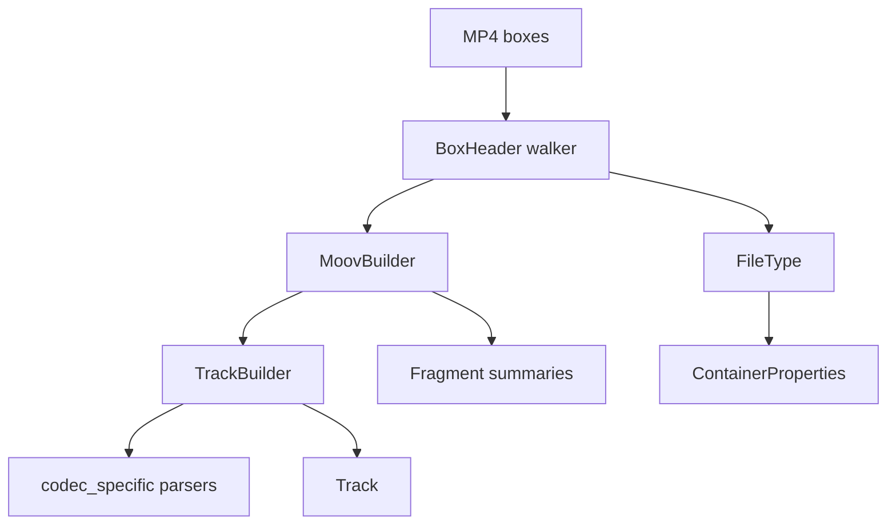

# MP4 / QuickTime Parser

Implementation progress: 90%

## Purpose

The MP4 parser recognises ISO BMFF, MP4, M4V, MOV, and QuickTime-style files. It extracts movie metadata, tracks, sample-entry codec data, iTunes metadata, fragments, and bounded first-sample verification.

## Implementation

- Primary implementation: `src-tauri/src/media_metadata/mp4/reader.rs`
- Related modules: `src-tauri/src/media_metadata/mp4/atom.rs`, `ftyp.rs`, `moov/`, `codec_specific/`, `meta/`, `fragments.rs`, `identify.rs`, `verify.rs`
- Upstream basis: `../mkvtoolnix/src/input/r_qtmp4.cpp`, `../mkvtoolnix/src/input/r_qtmp4.h`, upstream helpers under `../mkvtoolnix/src/common`

The parser scans top-level boxes, handles normal and zlib-compressed `moov` boxes, parses `ftyp`, `mvhd`, `trak`, `tkhd`, `mdia`, `mdhd`, `hdlr`, `stbl`, `stsd`, `stts`, `stsc`, `edts/elst`, `mvex/trex`, `moof/traf/tfhd/trun`, and `udta/meta/ilst`. Codec-specific parsers cover AVC, HEVC, AV1, AAC, ALAC, Opus, FLAC, color, pixel aspect ratio, and Dolby Vision block-addition records.

Every `stsd` sample-description entry is parsed (not just the first). Mirroring mkvtoolnix's `handle_stsd_atom` (`r_qtmp4.cpp:1370-1394`), which re-allocates `dmx.stsd` and re-runs the per-entry parse for each entry, the **last** entry's FOURCC / dimensions / audio properties / codec private data win; per-entry builder state is reset between entries so earlier values do not leak forward.

Codec-private data is normalised to match the byte layout mkvtoolnix hands its packetizers:

- **Opus (`dOps`)** — the box body is wrapped into a Matroska/Ogg Opus ID header: the 8-byte `"OpusHead"` magic is prepended and the pre-skip, input-sample-rate and output-gain fields are converted from MP4 big-endian to little-endian (`parse_dops_audio_header_priv_atom`, `r_qtmp4.cpp:3217-3243`). The bit depth is cleared for Opus.
- **FLAC (`dfLa`)** — the four-byte FullBox version/flags header is stripped; only the FLAC metadata block chain is stored as codec private (`parse_dfla_audio_header_priv_atom`, `r_qtmp4.cpp:3246-3266`). STREAMINFO is still decoded for sample rate / channels / bit depth.
- **ALAC (`alac`)** — only the ALACSpecificConfig (the FullBox payload, FullBox version/flags header stripped) is stored, matching the magic cookie `create_audio_packetizer_alac` clones from `stsd_non_priv_struct_size + 12` (`r_qtmp4.cpp:1833-1839`). The verification gate (`verify.rs`) therefore requires ≥ 24 codec-private bytes (`sizeof(codec_config_t)`).

## Data Structures

Key structures are `BoxHeader`, `FileType`, `MoovBuilder`, `TrackBuilder`, `TrexDefaults`, `MoofSummary`, and codec-specific config records.

QuickTime chapter tracks are also recognised: a track's `tref/chap` reference records the chapter track id (`handle_tref_atom`), and during finalisation the referenced text track's sample count is reported as the chapter count while the track itself is excluded from the track list (mirroring mkvtoolnix erasing `is_chapters()` demuxers). A Nero `udta/chpl` list takes precedence when both are present. The chapter sample *payloads* (titles/timecodes) are not read — only the entry count is surfaced, in keeping with the header-only contract.

## Gaps and Handling

Upstream has complete sample-table muxing, interleaving, and a wider QuickTime metadata surface, and reads chapter-track sample payloads to recover per-chapter titles and timecodes. Rust implements enough sample-table handling for first-sample verification and chapter counting but not packet output or chapter-name extraction. Rare atoms and codec branches are intentionally narrower; unknown private data is preserved where useful rather than interpreted unsafely.

## Open Issues

- `PARSER-229`: Multi-entry `stsd` handling over-applies last-entry-wins to the sample-entry FOURCC. mkvmerge parses every entry but keeps the first differing FOURCC and only warns about later ones; native resets `codec_id_str` for each entry, so a mixed-`stsd` track can be identified as the last codec instead of the first.
- `PARSER-230`: Vorbis-in-MP4 `esds` decoder config is not unlaced into the three Vorbis private headers and is not validated with the Vorbis header parser. mkvmerge derives channels/rate from that private data and rejects invalid headers; native only records the object type/length, so Vorbis tracks can be dropped for zero audio fields or kept without required codec private data.
- `PARSER-231`: MP4 Opus and FLAC audio verification is incomplete. mkvmerge rejects Opus without an `OpusHead` private blob of at least 19 bytes and FLAC without exactly one private `dfLa` blob; native's verifier only checks generic channels/rate, so malformed `Opus`/`fLaC` sample entries can survive if the sample entry itself carries nonzero audio fields.
