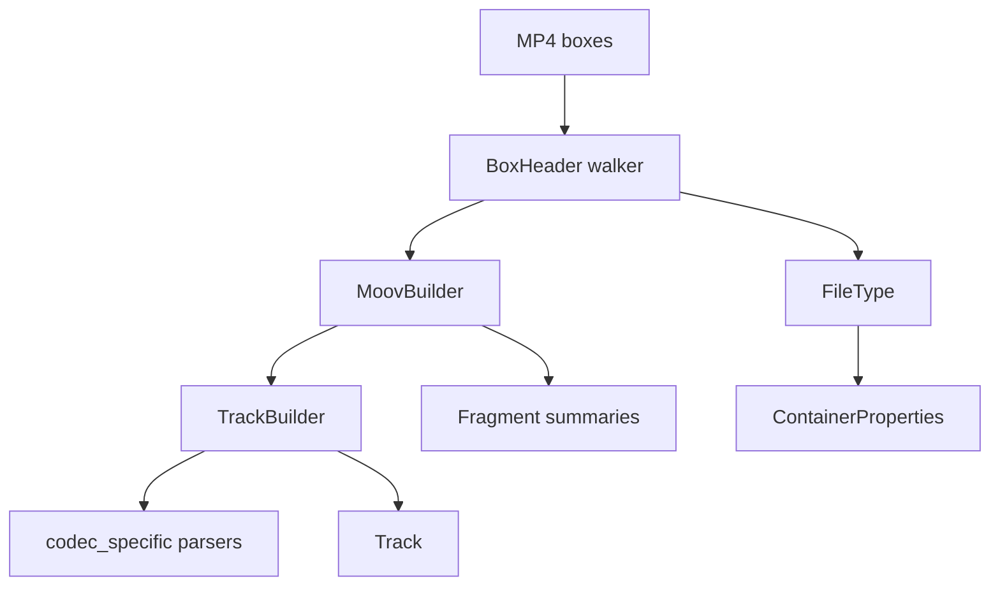

# MP4 / QuickTime Parser

Implementation progress: 100%

## Purpose

The MP4 parser recognises ISO BMFF, MP4, M4V, MOV, and QuickTime-style files. It extracts movie metadata, tracks, sample-entry codec data, iTunes metadata, fragments, and bounded first-sample verification.

## Implementation

- Primary implementation: `src-tauri/src/media_metadata/mp4/reader.rs`
- Related modules: `src-tauri/src/media_metadata/mp4/atom.rs`, `ftyp.rs`, `moov/`, `codec_specific/`, `meta/`, `fragments.rs`, `identify.rs`, `verify.rs`
- Upstream basis: `../mkvtoolnix/src/input/r_qtmp4.cpp`, `../mkvtoolnix/src/input/r_qtmp4.h`, upstream helpers under `../mkvtoolnix/src/common`

The parser scans top-level boxes, handles normal and zlib-compressed `moov` boxes, parses `ftyp`, `mvhd`, `trak`, `tkhd`, `mdia`, `mdhd`, `hdlr`, `stbl`, `stsd`, `stts`, `stsc`, `edts/elst`, `mvex/trex`, `moof/traf/tfhd/trun`, and `udta/meta/ilst`. Compressed QuickTime `cmov` handling reads the declared `cmvd` payload and inflates up to the movie size declared inside the compressed header, rather than using the old 64 MiB local cap. Codec-specific parsers cover AVC, HEVC, AV1, AAC, ALAC, Opus, FLAC, QuickTime PCM, color, pixel aspect ratio, and Dolby Vision block-addition records.

Every `stsd` sample-description entry is parsed (not just the first). Mirroring mkvtoolnix's `handle_stsd_atom` (`r_qtmp4.cpp:1370-1394`), which re-allocates `dmx.stsd` and re-runs the per-entry parse for each entry, the per-entry **sample data** (dimensions / audio properties / codec private) follows the **last** entry. The codec **identity** (FourCC / codec id / name), however, is taken from the **first** entry — mkvtoolnix keeps the first FourCC and only warns about later differing ones (`handle_audio_stsd_atom` / `handle_video_stsd_atom`, `r_qtmp4.cpp:3007-3013/3091-3099`). So `reset_sample_entry_state` clears the per-entry sample data but leaves the identity intact once the first entry has set it. The child-box-vs-opaque-private decision also uses that retained first FourCC, so later differing entries overwrite sample data without changing the private-data parser branch. The loop now iterates exactly the advertised `entry_count` and treats a count that extends past the `stsd` payload as malformed, matching upstream instead of keeping earlier parsed entries from a truncated atom (PARSER-300).

Codec-private data is normalised to match the byte layout mkvtoolnix hands its packetizers. AVC/HEVC/AV1 configuration boxes, `esds`, `colr`, opaque sample-entry private tails, FLAC `dfLa`, and Dolby Vision block-addition boxes preserve the full declared header payload under the shared parser element-size budget rather than applying codec-local 4 KiB or 64 KiB caps. Descriptor bodies inside `esds` are validated exactly before their lengths or payloads are recorded, so malformed DecoderSpecificInfo descriptors cannot satisfy later codec verification gates:

- **Opus (`dOps`)** — the box body is wrapped into a Matroska/Ogg Opus ID header: the 8-byte `"OpusHead"` magic is prepended and the pre-skip, input-sample-rate and output-gain fields are converted from MP4 big-endian to little-endian (`parse_dops_audio_header_priv_atom`, `r_qtmp4.cpp:3217-3243`). The bit depth is cleared for Opus.
- **FLAC (`dfLa`)** — the four-byte FullBox version/flags header is stripped; only the FLAC metadata block chain is stored as codec private (`parse_dfla_audio_header_priv_atom`, `r_qtmp4.cpp:3246-3266`). STREAMINFO is still decoded for sample rate / channels / bit depth.
- **ALAC (`alac`)** — only the ALACSpecificConfig (the FullBox payload, FullBox version/flags header stripped) is stored, matching the magic cookie `create_audio_packetizer_alac` clones from `stsd_non_priv_struct_size + 12` (`r_qtmp4.cpp:1833-1839`). The verification gate (`verify.rs`) therefore requires ≥ 24 codec-private bytes (`sizeof(codec_config_t)`).
- **AAC (`esds`)** — the DecoderSpecificInfo bytes are parsed through the shared AAC AudioSpecificConfig decoder used by the elementary readers. Parsed AAC channels, sample rate, and SBR output rate override the sample-entry placeholders; if an AAC `esds` is missing DecoderSpecificInfo or carries fewer than two bytes, a default AudioSpecificConfig is synthesised from the sample-entry channels and sample rate, matching `parse_aac_esds_decoder_config`.

Audio verification (`verify.rs`) mirrors the codec-specific early returns of `qtmp4_demuxer_c::verify_audio_parameters` (`r_qtmp4.cpp:3660-3701`):

- **FLAC** is kept only when exactly one private blob (the `dfLa` metadata) is present.
- **Opus** requires an `OpusHead` private blob of at least 19 bytes (`derive_track_params_from_opus_private_data`).
- **Vorbis** (esds objectTypeIndication `0xDD`) has its DecoderSpecificInfo unlaced into the three Xiph-laced headers (`unlace_xiph`, a port of `unlace_memory_xiph`); the identification header then supplies the channel count and sample rate (`derive_track_params_from_vorbis_private_data`). A track that does not unlace into exactly three packets, or whose first packet is not a valid Vorbis identification header, is dropped.

These three return before the generic "channels or sample rate is zero" gate, exactly as upstream does.

QuickTime PCM sample entries (`twos`, `sowt`, `raw `, `pcm `, `lpcm`, and `in24`) are canonicalised to the Matroska PCM codec ids mkvmerge would choose. Version 2 `lpcm` sample entries keep `formatSpecificFlags`, allowing `verify.rs` / `identify.rs` to distinguish little-endian integer, big-endian integer, and IEEE float PCM; `in24` forces a 24-bit sample depth as upstream does.

When an AVC sample entry lacks a usable `avcC`, `derive_avc_from_bitstream` reads bounded first-sample Annex B data and rebuilds an avcC via `build_avcc`. The rebuilt record preserves the SPS constraint-set / profile-compatibility byte in AVCDecoderConfigurationRecord byte 2 (`buffer[2] = sps.profile_compat`, `../mkvtoolnix/src/common/avc/avcc.cpp:134`) rather than writing zero.

HEVC verification mirrors mkvtoolnix's Annex B fallback. Before rejecting an `hvc1` / `hev1` track without `hvcC`, the verifier checks whether the indexed first sample starts with `00 00 00 01`, then reads up to 1 MiB of first-sample bytes and feeds the existing elementary HEVC parser. If VPS/SPS/PPS headers are recovered, it builds an `hvcC` configuration record, stores it as codec private, and applies the normal 23-byte HEVC config gate (PARSER-313).

First-sample verification reconstructs only the sample extents covered by `stsc` + `stco`/`co64` + `stsz`/`stz2`. Missing `stsc` coverage produces no synthetic one-sample chunks, and zero or missing sample sizes remain zero-sized index entries (PARSER-299). `read_first_bytes` then mirrors `qtmp4_demuxer_c::read_first_bytes`: it reads `min(remaining, sample.size)` from each indexed sample and returns no buffer unless the full requested window (64, 10000, 16384, or up to 1 MiB for HEVC Annex B salvage) is collected with exact media reads (PARSER-298). Truncated `mdat` data, short indexed windows, and zero-sized samples therefore cannot satisfy MP3/AC-3/DTS parameter recovery or AVC/HEVC bitstream salvage.

Subtitle classification follows mkvtoolnix's MP4 handler list: only `text`, `subp`, and `sbtl` handlers are subtitle tracks; `subt` is treated as unknown and skipped. Subtitle verification keeps only TX3G (`text` / `tx3g` / `S_TX3G`) or VobSub with a DecoderSpecificInfo payload of at least 64 bytes. Other subtitle sample entries such as `wvtt`, `stpp`, and private image/text entries are rejected before compact track ids are assigned (PARSER-314).

Generic MPEG-4 system sample entries are refined through mkvtoolnix's `codec_c::look_up_object_type_id` set only: AAC (`0x40`, `0x66`-`0x68`), MP3 (`0x69`), MP2 (`0x6B`), DTS (`0xA9`), Vorbis (`0xDD`), MPEG-1/2 video (`0x60`-`0x65`, `0x6A`), MPEG-4 Visual (`0x20`), and VobSub (`0xE0`). Object types outside that set, including AC-3/E-AC-3 private values, HEVC, AVC, and JPEG IDs not recognised by mkvtoolnix's table, remain unsupported and are dropped or handled by the sample-entry FOURCC fallback just as upstream would (PARSER-315).

## Data Structures

Key structures are `BoxHeader`, `FileType`, `MoovBuilder`, `TrackBuilder`, `TrexDefaults`, `MoofSummary`, and codec-specific config records.

QuickTime chapter tracks are also recognised: a track's `tref/chap` reference records the chapter track id (`handle_tref_atom`), and during finalisation the referenced text track's sample count is reported as the chapter count while the track itself is excluded from the track list (mirroring mkvtoolnix erasing `is_chapters()` demuxers). A Nero `udta/chpl` list takes precedence when both are present. The chapter sample *payloads* (titles/timecodes) are not read — only the entry count is surfaced, in keeping with the header-only contract.

## Gaps and Handling

Upstream has complete sample-table muxing, interleaving, and a wider QuickTime metadata surface, and reads chapter-track sample payloads to recover per-chapter titles and timecodes. Rust implements enough sample-table handling for first-sample verification and chapter counting but not packet output or chapter-name extraction. Rare atoms and codec branches are intentionally narrower; unknown private data is preserved where useful rather than interpreted unsafely. The Vorbis codec private kept on the model is the raw esds decoder configuration (informational); the muxing-time re-lacing into Matroska Vorbis private data is a packetizer concern out of scope for identification. The `hvcC` parser reads `chromaFormat` from byte 16, `bitDepthLumaMinus8` from byte 17 and `bitDepthChromaMinus8` from byte 18 (the avgFrameRate bytes 19-20 are ignored), matching `../mkvtoolnix/src/common/hevc/hevcc.cpp`. HEVC Annex B salvage, subtitle verification, `esds` object-type mapping, compressed `cmov`, and codec-private preservation now follow mkvtoolnix's identification gates.

## Open Issues

- `PARSER-341`: HEVC Annex B fallback can still fail on small-sample tracks. `verify.rs` may request 128 KiB through 1 MiB for `check_for_hevc_video_annex_b_bitstream`, but `stbl::build_first_samples` stops the reconstructed sample index after 16 KiB of aggregate sample sizes. mkvtoolnix's `qtmp4_demuxer_c::read_first_bytes` walks the full index until the requested byte count is satisfied. A fragmented run of many small HEVC samples can therefore fail local `hvcC` derivation even though mkvtoolnix would recover VPS/SPS/PPS within the 1 MiB probe window.
- `PARSER-342`: iTunes metadata handling still diverges from `handle_ilst_atom`. Local `ilst` parsing caps ordinary text values and reverse-DNS `----` fields at 16 KiB / 4 KiB, filters normal metadata by the MP4 `data` type code, maps `©day` and unknown atoms into extra fields/tags, and emits `iTunSMPB` as a tag. mkvtoolnix reads the full `data` payload as a string for only `©nam`, `©too`, and `©cmt`, strips it, stores title/encoder/comment, and consumes `----:iTunSMPB` for encoder-delay state without exposing it as a tag. Long title/encoder/comment values can be truncated or skipped locally, while unsupported metadata can be over-reported.
