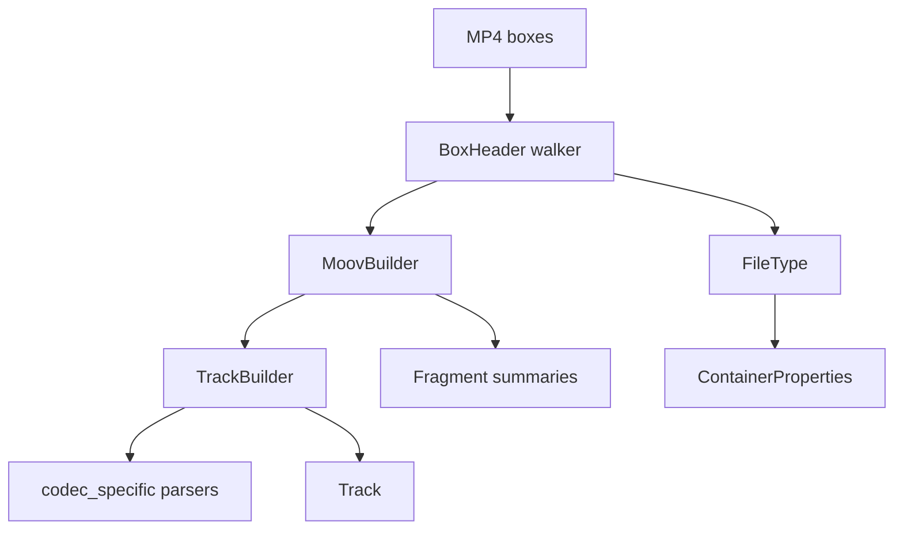

# MP4 / QuickTime Parser

Implementation progress: 85%

## Purpose

The MP4 parser recognises ISO BMFF, MP4, M4V, MOV, and QuickTime-style files. It extracts movie metadata, tracks, sample-entry codec data, iTunes metadata, fragments, and bounded first-sample verification.

## Implementation

- Primary implementation: `src-tauri/src/media_metadata/mp4/reader.rs`
- Related modules: `src-tauri/src/media_metadata/mp4/atom.rs`, `ftyp.rs`, `moov/`, `codec_specific/`, `meta/`, `fragments.rs`, `identify.rs`, `verify.rs`
- Upstream basis: `../mkvtoolnix/src/input/r_qtmp4.cpp`, `../mkvtoolnix/src/input/r_qtmp4.h`, upstream helpers under `../mkvtoolnix/src/common`

The parser scans top-level boxes, handles normal and zlib-compressed `moov` boxes, parses `ftyp`, `mvhd`, `trak`, `tkhd`, `mdia`, `mdhd`, `hdlr`, `stbl`, `stsd`, `stts`, `stsc`, `edts/elst`, `mvex/trex`, `moof/traf/tfhd/trun`, and `udta/meta/ilst`. Codec-specific parsers cover AVC, HEVC, AV1, AAC, ALAC, Opus, FLAC, color, pixel aspect ratio, and Dolby Vision block-addition records.

## Data Structures

Key structures are `BoxHeader`, `FileType`, `MoovBuilder`, `TrackBuilder`, `TrexDefaults`, `MoofSummary`, and codec-specific config records.

## Gaps and Handling

Upstream has complete sample-table muxing, interleaving, chapter-track and `tref` behavior, and a wider QuickTime metadata surface. Rust implements enough sample-table handling for first-sample verification but not packet output. Rare atoms and codec branches are intentionally narrower; unknown private data is preserved where useful rather than interpreted unsafely.
