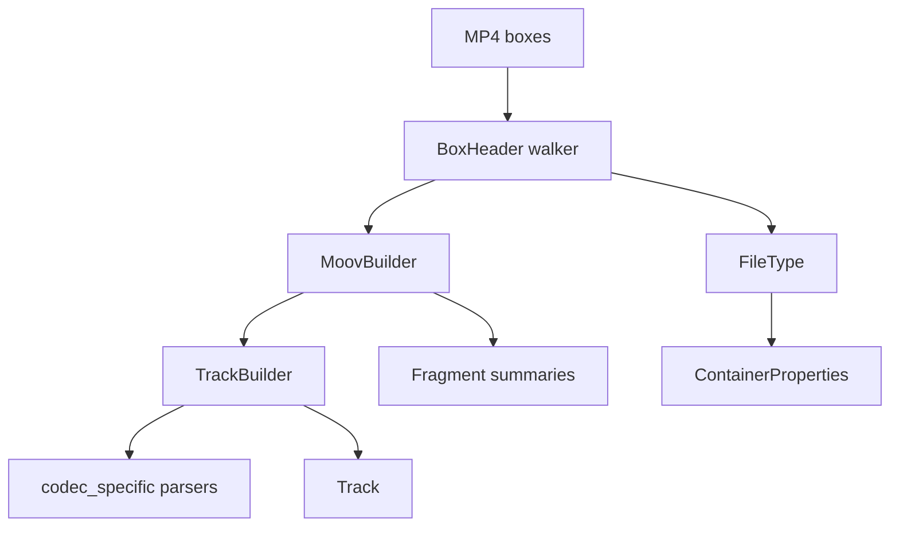

# MP4 / QuickTime Parser

Implementation progress: 93%

## Purpose

The MP4 parser recognises ISO BMFF, MP4, M4V, MOV, and QuickTime-style files. It extracts movie metadata, tracks, sample-entry codec data, iTunes metadata, fragments, and bounded first-sample verification.

## Implementation

- Primary implementation: `src-tauri/src/media_metadata/mp4/reader.rs`
- Related modules: `src-tauri/src/media_metadata/mp4/atom.rs`, `ftyp.rs`, `moov/`, `codec_specific/`, `meta/`, `fragments.rs`, `identify.rs`, `verify.rs`
- Upstream basis: `../mkvtoolnix/src/input/r_qtmp4.cpp`, `../mkvtoolnix/src/input/r_qtmp4.h`, upstream helpers under `../mkvtoolnix/src/common`

The parser scans top-level boxes, handles normal and zlib-compressed `moov` boxes, parses `ftyp`, `mvhd`, `trak`, `tkhd`, `mdia`, `mdhd`, `hdlr`, `stbl`, `stsd`, `stts`, `stsc`, `edts/elst`, `mvex/trex`, `moof/traf/tfhd/trun`, and `udta/meta/ilst`. Codec-specific parsers cover AVC, HEVC, AV1, AAC, ALAC, Opus, FLAC, color, pixel aspect ratio, and Dolby Vision block-addition records.

Every `stsd` sample-description entry is parsed (not just the first). Mirroring mkvtoolnix's `handle_stsd_atom` (`r_qtmp4.cpp:1370-1394`), which re-allocates `dmx.stsd` and re-runs the per-entry parse for each entry, the per-entry **sample data** (dimensions / audio properties / codec private) follows the **last** entry. The codec **identity** (FourCC / codec id / name), however, is taken from the **first** entry — mkvtoolnix keeps the first FourCC and only warns about later differing ones (`handle_audio_stsd_atom` / `handle_video_stsd_atom`, `r_qtmp4.cpp:3007-3013/3091-3099`). So `reset_sample_entry_state` clears the per-entry sample data but leaves the identity intact once the first entry has set it.

Codec-private data is normalised to match the byte layout mkvtoolnix hands its packetizers:

- **Opus (`dOps`)** — the box body is wrapped into a Matroska/Ogg Opus ID header: the 8-byte `"OpusHead"` magic is prepended and the pre-skip, input-sample-rate and output-gain fields are converted from MP4 big-endian to little-endian (`parse_dops_audio_header_priv_atom`, `r_qtmp4.cpp:3217-3243`). The bit depth is cleared for Opus.
- **FLAC (`dfLa`)** — the four-byte FullBox version/flags header is stripped; only the FLAC metadata block chain is stored as codec private (`parse_dfla_audio_header_priv_atom`, `r_qtmp4.cpp:3246-3266`). STREAMINFO is still decoded for sample rate / channels / bit depth.
- **ALAC (`alac`)** — only the ALACSpecificConfig (the FullBox payload, FullBox version/flags header stripped) is stored, matching the magic cookie `create_audio_packetizer_alac` clones from `stsd_non_priv_struct_size + 12` (`r_qtmp4.cpp:1833-1839`). The verification gate (`verify.rs`) therefore requires ≥ 24 codec-private bytes (`sizeof(codec_config_t)`).

Audio verification (`verify.rs`) mirrors the codec-specific early returns of `qtmp4_demuxer_c::verify_audio_parameters` (`r_qtmp4.cpp:3660-3701`):

- **FLAC** is kept only when exactly one private blob (the `dfLa` metadata) is present.
- **Opus** requires an `OpusHead` private blob of at least 19 bytes (`derive_track_params_from_opus_private_data`).
- **Vorbis** (esds objectTypeIndication `0xDD`) has its DecoderSpecificInfo unlaced into the three Xiph-laced headers (`unlace_xiph`, a port of `unlace_memory_xiph`); the identification header then supplies the channel count and sample rate (`derive_track_params_from_vorbis_private_data`). A track that does not unlace into exactly three packets, or whose first packet is not a valid Vorbis identification header, is dropped.

These three return before the generic "channels or sample rate is zero" gate, exactly as upstream does.

When an AVC sample entry lacks a usable `avcC`, `derive_avc_from_bitstream` reads bounded first-sample Annex B data and rebuilds an avcC via `build_avcc`. The rebuilt record preserves the SPS constraint-set / profile-compatibility byte in AVCDecoderConfigurationRecord byte 2 (`buffer[2] = sps.profile_compat`, `../mkvtoolnix/src/common/avc/avcc.cpp:134`) rather than writing zero.

## Data Structures

Key structures are `BoxHeader`, `FileType`, `MoovBuilder`, `TrackBuilder`, `TrexDefaults`, `MoofSummary`, and codec-specific config records.

QuickTime chapter tracks are also recognised: a track's `tref/chap` reference records the chapter track id (`handle_tref_atom`), and during finalisation the referenced text track's sample count is reported as the chapter count while the track itself is excluded from the track list (mirroring mkvtoolnix erasing `is_chapters()` demuxers). A Nero `udta/chpl` list takes precedence when both are present. The chapter sample *payloads* (titles/timecodes) are not read — only the entry count is surfaced, in keeping with the header-only contract.

## Gaps and Handling

Upstream has complete sample-table muxing, interleaving, and a wider QuickTime metadata surface, and reads chapter-track sample payloads to recover per-chapter titles and timecodes. Rust implements enough sample-table handling for first-sample verification and chapter counting but not packet output or chapter-name extraction. Rare atoms and codec branches are intentionally narrower; unknown private data is preserved where useful rather than interpreted unsafely. The Vorbis codec private kept on the model is the raw esds decoder configuration (informational); the muxing-time re-lacing into Matroska Vorbis private data is a packetizer concern out of scope for identification. The `hvcC` parser reads `chromaFormat` from byte 16, `bitDepthLumaMinus8` from byte 17 and `bitDepthChromaMinus8` from byte 18 (the avgFrameRate bytes 19-20 are ignored), matching `../mkvtoolnix/src/common/hevc/hevcc.cpp`.

## Open Issues

### PARSER-262: AAC `mp4a` tracks without DecoderSpecificInfo are dropped instead of synthesising a default AudioSpecificConfig

- Native evidence: `mp4/codec_specific/esds.rs` records `DecoderSpecificInfo` only when tag `0x05` is present, and `mp4/identify.rs` drops `A_AAC` tracks when `audio_codec_config.aac_object_type` is absent.
- Upstream evidence: `qtmp4_demuxer_c::parse_aac_esds_decoder_config` creates a default AAC AudioSpecificConfig from the sample-entry channel count and sample rate when `esds.decoder_config` is absent or shorter than two bytes.
- Impact: valid QuickTime/MP4 AAC tracks that mkvmerge keeps are missing from native metadata.
- Suggested fix: generate the same default ASC before the AAC verification/drop gate, using the sample-entry audio fields and preserving bounded header-only behavior.

### PARSER-263: MP4 AAC ignores AudioSpecificConfig-derived sample rate and channel metadata

- Native evidence: `mp4/codec_specific/esds.rs::parse_audio_specific_config` reads `sample_rate_index` and `channel_config` but discards them, so `TrackProperties.audio` keeps the sample-entry placeholders.
- Upstream evidence: after parsing `esds.decoder_config`, `parse_aac_esds_decoder_config` assigns `a_channels` from the parsed AAC config and overwrites `a_samplerate` with the parsed sample rate.
- Impact: AAC-in-MP4 tracks with placeholder `stsd` channels/rate, PCE channel layouts, or SBR output-rate signalling can report different audio properties from mkvmerge.
- Suggested fix: parse the ASC through the shared AAC parser and apply its `channels`, `sample_rate`, and `output_sample_rate` to the MP4 audio properties.

### PARSER-264: MP4 `esds` keeps a stale duplicate AAC AudioSpecificConfig parser

- Native evidence: `mp4/codec_specific/esds.rs` has a private `BitCursor` ASC decoder that only consumes a subset of GA/SBR/PS fields and silently reads zeros past the end of truncated payloads.
- Upstream evidence: MP4 calls the same common `mtx::aac::parse_audio_specific_config` path as other AAC readers. The Rust common AAC path already has ELD, CELP, ER error-protection, PCE, and failure semantics that the MP4 copy lacks.
- Impact: MP4 AAC `AudioCodecConfig` can diverge from raw AAC, RealMedia, FLV, and mkvmerge for less common object types or malformed ASC payloads.
- Suggested fix: remove the MP4-local ASC parser and reuse `audio::aac::parse_audio_specific_config_bytes` plus `codec_config_from_header`.

### PARSER-265: QuickTime PCM sample entries are not treated as mkvmerge PCM

- Native evidence: the FOURCC catalogue recognises `PCM `, `raw `, `sowt`, and `twos`, but not QuickTime `lpcm` or `in24`; `stsd` also skips the `lpcm` `formatSpecificFlags` and `verify.rs` has no `in24` 24-bit correction.
- Upstream evidence: `codec.cpp` maps `twos|sowt|raw.|lpcm|in24` to PCM, `verify_audio_parameters` forces `in24` bit depth to 24, and `determine_codec` derives the `lpcm` integer/float/endian packetizer format from `a_flags`.
- Impact: QuickTime PCM tracks can lose their codec name/PCM classification, keep the wrong bit depth, or miss float/big-endian signalling even though the needed data is in the sample entry.
- Suggested fix: add `lpcm`/`in24` to the MP4/FOURCC PCM handling, parse `formatSpecificFlags`, and mirror the `in24` bit-depth override.
