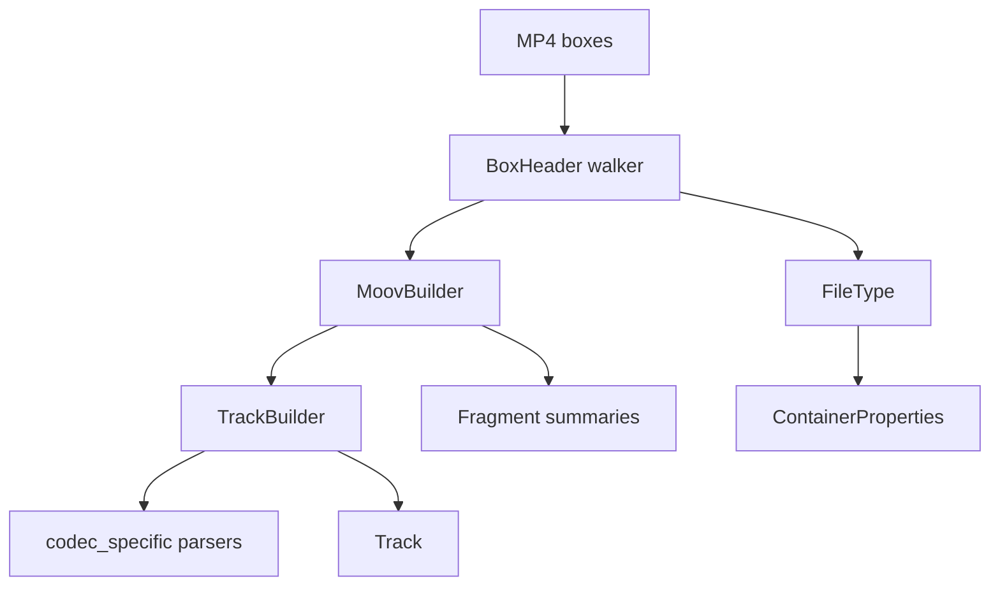

# MP4 / QuickTime Parser

Implementation progress: 88%

## Purpose

The MP4 parser recognises ISO BMFF, MP4, M4V, MOV, and QuickTime-style files. It extracts movie metadata, tracks, sample-entry codec data, iTunes metadata, fragments, and bounded first-sample verification.

## Implementation

- Primary implementation: `src-tauri/src/media_metadata/mp4/reader.rs`
- Related modules: `src-tauri/src/media_metadata/mp4/atom.rs`, `ftyp.rs`, `moov/`, `codec_specific/`, `meta/`, `fragments.rs`, `identify.rs`, `verify.rs`
- Upstream basis: `../mkvtoolnix/src/input/r_qtmp4.cpp`, `../mkvtoolnix/src/input/r_qtmp4.h`, upstream helpers under `../mkvtoolnix/src/common`

The parser scans top-level boxes, handles normal and zlib-compressed `moov` boxes, parses `ftyp`, `mvhd`, `trak`, `tkhd`, `mdia`, `mdhd`, `hdlr`, `stbl`, `stsd`, `stts`, `stsc`, `edts/elst`, `mvex/trex`, `moof/traf/tfhd/trun`, and `udta/meta/ilst`. Codec-specific parsers cover AVC, HEVC, AV1, AAC, ALAC, Opus, FLAC, color, pixel aspect ratio, and Dolby Vision block-addition records.

Every `stsd` sample-description entry is parsed (not just the first). Mirroring mkvtoolnix's `handle_stsd_atom` (`r_qtmp4.cpp:1370-1394`), which re-allocates `dmx.stsd` and re-runs the per-entry parse for each entry, the **last** entry's FOURCC / dimensions / audio properties / codec private data win; per-entry builder state is reset between entries so earlier values do not leak forward.

Codec-private data is normalised to match the byte layout mkvtoolnix hands its packetizers:

- **Opus (`dOps`)** — the box body is wrapped into a Matroska/Ogg Opus ID header: the 8-byte `"OpusHead"` magic is prepended and the pre-skip, input-sample-rate and output-gain fields are converted from MP4 big-endian to little-endian (`parse_dops_audio_header_priv_atom`, `r_qtmp4.cpp:3217-3243`). The bit depth is cleared for Opus.
- **FLAC (`dfLa`)** — the four-byte FullBox version/flags header is stripped; only the FLAC metadata block chain is stored as codec private (`parse_dfla_audio_header_priv_atom`, `r_qtmp4.cpp:3246-3266`). STREAMINFO is still decoded for sample rate / channels / bit depth.
- **ALAC (`alac`)** — only the ALACSpecificConfig (the FullBox payload, FullBox version/flags header stripped) is stored, matching the magic cookie `create_audio_packetizer_alac` clones from `stsd_non_priv_struct_size + 12` (`r_qtmp4.cpp:1833-1839`). The verification gate (`verify.rs`) therefore requires ≥ 24 codec-private bytes (`sizeof(codec_config_t)`).

## Data Structures

Key structures are `BoxHeader`, `FileType`, `MoovBuilder`, `TrackBuilder`, `TrexDefaults`, `MoofSummary`, and codec-specific config records.

## Gaps and Handling

Upstream has complete sample-table muxing, interleaving, chapter-track and `tref` behavior, and a wider QuickTime metadata surface. Rust implements enough sample-table handling for first-sample verification but not packet output. Rare atoms and codec branches are intentionally narrower; unknown private data is preserved where useful rather than interpreted unsafely.

## Open Issues

### PARSER-212: QuickTime chapter tracks referenced by `tref/chap` are not extracted

Native only counts Nero-style `udta/chpl` chapter lists (`src-tauri/src/media_metadata/mp4/meta/udta.rs:49-114`). The `trak` walker ignores `tref`, and no path marks a text track as the movie's chapter source or reads its sample-table entries as chapter names. Upstream records `tref/chap` track IDs (`../mkvtoolnix/src/input/r_qtmp4.cpp:1666-1679`), calls `read_chapter_track()` after header parsing (`r_qtmp4.cpp:323`), reads the chapter track sample payloads (`r_qtmp4.cpp:1171-1207`), and reports the resulting chapter count during identify (`r_qtmp4.cpp:2260-2261`). MOV/MP4 files that store chapters as QuickTime text tracks therefore report no chapters natively even though mkvmerge identifies them.
