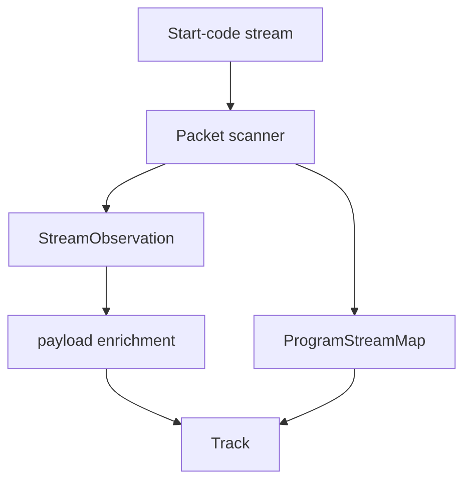

# MPEG Program Stream Parser

Implementation progress: 78%

## Purpose

The MPEG-PS parser recognises MPEG program streams and VOB-like files, discovers PES streams, uses program-stream maps when present, and enriches video/audio metadata from payload prefixes.

## Implementation

- Primary implementation: `src-tauri/src/media_metadata/mpeg_ps/reader.rs`
- Related modules: `packet.rs`, `pes.rs`, `stream_map.rs`, `identify.rs`
- Upstream basis: `../mkvtoolnix/src/input/r_mpeg_ps.cpp`, `../mkvtoolnix/src/input/r_mpeg_ps.h`

The parser scans start codes, recognises pack and system headers, parses program stream maps, discovers private-stream sub IDs, accumulates bounded payload prefixes, and classifies MPEG video, AVC, VC-1, MPEG audio, AAC, AC-3, DTS, TrueHD, LPCM, and VobSub-style private streams.

PES depacketising (`pes::pes_payload_offset`) is a port of `mpeg_ps_reader_c::parse_packet` (`r_mpeg_ps.cpp:343-468`) and supports **both** the MPEG-1 and MPEG-2 PES optional-header layouts (PARSER-272). Starting after the 6-byte prefix it skips `0xff` stuffing, an optional 2-byte STD buffer size (`c & 0xc0 == 0x40`), then consumes the MPEG-1 PTS (`c & 0xf0 == 0x20`, 4 bytes) or PTS+DTS (`c & 0xf0 == 0x30`, 9 bytes), the MPEG-2 optional header (`c & 0xc0 == 0x80`, `flags + header_data_length + that many bytes`), or — for the MPEG-1 no-timestamp marker `0x0f` — nothing, before exposing the elementary payload (the sub-stream-id byte for `0xBD`). MPEG-1 program streams have no `PES_header_data_length` at byte 8, so the elementary payload is now located correctly instead of skipping into or past real stream data. All bounds come from the declared `packet_length`; a zero length (unbounded MPEG-2 video) uses the available buffer.

MPEG audio (bare stream ids `0xC0..0xDF`, defaulted to `A_MPEG/L3`, and PSM stream types `0x03`/`0x04`, defaulted to `A_MPEG/L2`) is relabelled to the actual Layer I / II / III once the first frame header decodes — mirroring `new_stream_a_mpeg`'s `codec = header.get_codec()` (`r_mpeg_ps.cpp`). The probe needs only a single frame header (not two), matching upstream's `find_mp3_header`, so a short bounded payload that mkvtoolnix can identify is not rejected. When no header decodes, the table default id is retained.

Program Stream Map classification is limited to mkvmerge's `found_new_stream` `es_type` switch: `0x01`, `0x02`, `0x03`, `0x04`, `0x0f`, `0x10`, `0x11`, `0x1b`, `0x80`, and `0x81`. Unsupported nonzero PSM stream types are left unclassified and dropped rather than falling back to a bare stream-id guess; DTS, TrueHD, LPCM, and VobSub handling still comes from private-stream-1 substream ids.

## Data Structures

Key structures are `StartCode`, `PesHeader`, `ProgramStreamMap`, `PsmEntry`, and `StreamObservation`.

## Gaps and Handling

Upstream has broader scaling probe windows, timestamp-offset calculation, multi-file VOB opening, packet delivery, and more late-stream recovery. Rust keeps bounded discovery and payload enrichment so metadata extraction remains fast and deterministic. PES depacketising now handles both MPEG-1 and MPEG-2 optional-header layouts, so MPEG-1 program-stream payloads are no longer misaligned.

## Open Issues

### PARSER-276: Packet scanning searches inside non-PES bodies and ignores the declared PSM length

`src-tauri/src/media_metadata/mpeg_ps/reader.rs:145-153` parses a Program Stream Map from all remaining bytes after the start code, then advances only to `pos + 4`. The generic non-PES branch for pack headers, system headers, padding, private-stream-2, and other packet-layer codes also advances only to `pos + 4` (`reader.rs:204-207`). As a result, the next `find_start_code` search can run through packet bodies and descriptor payloads instead of resuming after those structures.

`src-tauri/src/media_metadata/mpeg_ps/stream_map.rs:51-97` also ignores `program_stream_map_length`: it reads program/elementary map lengths against the full remaining slice, accepts zero or overlarge PSM lengths, and can parse stream entries from bytes outside the declared map.

mkvtoolnix skips pack header stuffing and system-header descriptors before reading the next header (`../mkvtoolnix/src/input/r_mpeg_ps.cpp:103-135`). Its PSM parser reads the declared length, rejects zero or `> 1018`, clamps the ES map to that declared body, and then seeks away from the PSM before resyncing (`../mkvtoolnix/src/input/r_mpeg_ps.cpp:271-305`, `1136-1139`).

Impact: Rust can treat `00 00 01 xx` byte patterns inside pack/system/PSM/padding payloads as real stream packets, producing false observations or feeding codec probes with descriptor bytes. It can also accept PSM stream-type mappings mkvtoolnix would never read.

Suggested fix: implement packet-specific skipping for pack headers, system headers, padding/private-stream-2/other bounded packet bodies, and Program Stream Maps. Pass only the declared PSM body to `stream_map::parse`, enforce the upstream length limits and clamping, and advance the scanner past the skipped structure before searching for the next packet-layer start code.
