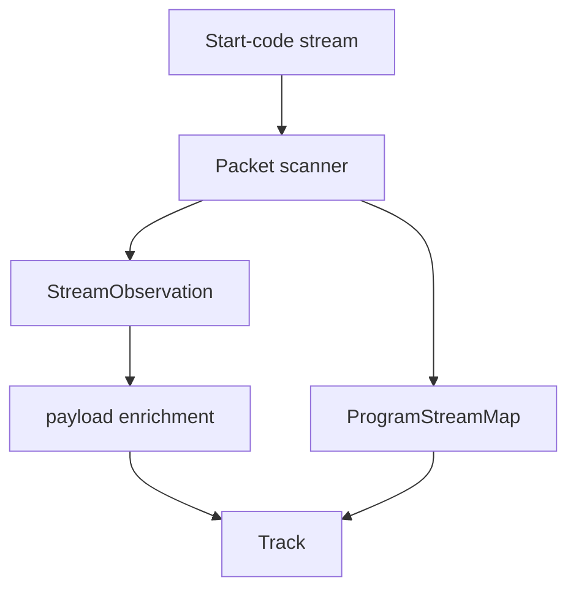

# MPEG Program Stream Parser

Implementation progress: 100%

## Purpose

The MPEG-PS parser recognises MPEG program streams and VOB-like files, discovers PES streams, uses program-stream maps when present, and enriches video/audio metadata from payload prefixes.

## Implementation

- Primary implementation: `src-tauri/src/media_metadata/mpeg_ps/reader.rs`
- Related modules: `packet.rs`, `pes.rs`, `stream_map.rs`, `identify.rs`
- Upstream basis: `../mkvtoolnix/src/input/r_mpeg_ps.cpp`, `../mkvtoolnix/src/input/r_mpeg_ps.h`

The parser scans packet-layer start codes, recognises pack and system headers, parses program stream maps, discovers private-stream sub IDs, accumulates bounded payload prefixes, and classifies MPEG video, AVC, VC-1, MPEG audio, AC-3, DTS, TrueHD, LPCM, and VobSub-style private streams. Packet-layer scanning skips pack-header stuffing, declared system-header bodies, Program Stream Maps, padding, private-stream-2, and other bounded packet bodies before looking for the next start code, so `00 00 01` byte patterns inside descriptors or payloads are not treated as real packets.

PES depacketising (`pes::pes_payload_offset`) is a port of `mpeg_ps_reader_c::parse_packet` (`r_mpeg_ps.cpp:343-468`) and supports **both** the MPEG-1 and MPEG-2 PES optional-header layouts (PARSER-272). Starting after the 6-byte prefix it skips `0xff` stuffing, an optional 2-byte STD buffer size (`c & 0xc0 == 0x40`), then consumes the MPEG-1 PTS (`c & 0xf0 == 0x20`, 4 bytes) or PTS+DTS (`c & 0xf0 == 0x30`, 9 bytes), the MPEG-2 optional header (`c & 0xc0 == 0x80`, `flags + header_data_length + that many bytes`), or — for the MPEG-1 no-timestamp marker `0x0f` — nothing, before exposing the elementary payload (the sub-stream-id byte for `0xBD`). MPEG-1 program streams have no `PES_header_data_length` at byte 8, so the elementary payload is now located correctly instead of skipping into or past real stream data. All bounds come from the declared `packet_length`; a zero length (unbounded MPEG-2 video) uses the available buffer.

MPEG audio (bare stream ids `0xC0..0xDF`, defaulted to `A_MPEG/L3`, and PSM stream types `0x03`/`0x04`, defaulted to `A_MPEG/L2`) is relabelled to the actual Layer I / II / III once the first frame header decodes — mirroring `new_stream_a_mpeg`'s `codec = header.get_codec()` (`r_mpeg_ps.cpp`). The probe needs only a single frame header (not two), matching upstream's `find_mp3_header`, so a short bounded payload that mkvtoolnix can identify is not rejected. When no header decodes, the stream is blocked and no default MPEG-audio track is emitted.

Program Stream Map classification is limited to mkvmerge's `found_new_stream` `es_type` switch: `0x01`, `0x02`, `0x03`, `0x04`, `0x0f`, `0x10`, `0x11`, `0x1b`, `0x80`, and `0x81`. Unsupported nonzero PSM stream types are left unclassified and dropped rather than falling back to a bare stream-id guess; DTS, TrueHD, LPCM, and VobSub handling still comes from private-stream-1 substream ids. PSM AAC (`0x0f`/`0x11`) and MPEG-4 Visual (`0x10`) entries are recognised at map level but not emitted because mkvmerge's MPEG-PS header path has no supported `new_stream_*` probe for them. The PSM parser enforces mkvmerge's declared length bounds (`1..=1018`) and clamps the elementary-stream map to the declared body before the CRC.

Finalisation mirrors mkvmerge's blocking behavior for codec probes. MPEG-1/2 video needs sequence, picture, and slice evidence (`looks_like_mpeg_video_es`) before its sequence header can contribute dimensions; bare MPEG video that is actually Annex B AVC is promoted only when the AVC helper sees SPS, PPS, and access-unit evidence. Explicit AVC also uses that complete Annex B gate. VC-1 needs an advanced-profile sequence header; MPEG audio, AC-3, DTS, TrueHD, and DVD LPCM each need their corresponding first header to decode. Streams whose accumulated payload never validates are dropped instead of producing default tracks from stream IDs alone. Before track ids are assigned, emitted tracks are sorted by mkvmerge's bucket order (`video`, `audio`, `subtitles`, other) and encoded stream id `((stream_id << 8) | sub_id)` (PARSER-347).

## Data Structures

Key structures are `StartCode`, `PesHeader`, `ProgramStreamMap`, `PsmEntry`, and `StreamObservation`.

## Gaps and Handling

Upstream has broader percentage-based scaling above the fixed probe floor, timestamp-offset calculation, multi-file VOB opening, packet delivery, and more late-stream recovery. Rust keeps bounded discovery and payload enrichment so metadata extraction remains fast and deterministic. The fixed 10 MiB probe range is also the per-stream payload cap, so video evidence can be found anywhere inside the local probe window instead of being truncated by a smaller stream-local limit. PES depacketising handles both MPEG-1 and MPEG-2 optional-header layouts, codec probes block false-positive stream ids, and output ordering follows mkvmerge's identification order.

## Open Issues

- `PARSER-350` - Explicit AVC streams and MPEG-video-to-AVC promotion reuse the raw AVC helper whose access-unit gate does not mirror `es_parser_c::headers_parsed()`. AUD-only evidence after SPS/PPS can promote a PS stream locally, while upstream only uses AUD to flush an already-built frame; conversely, some upstream NAL evidence paths are not counted by the Rust helper.
