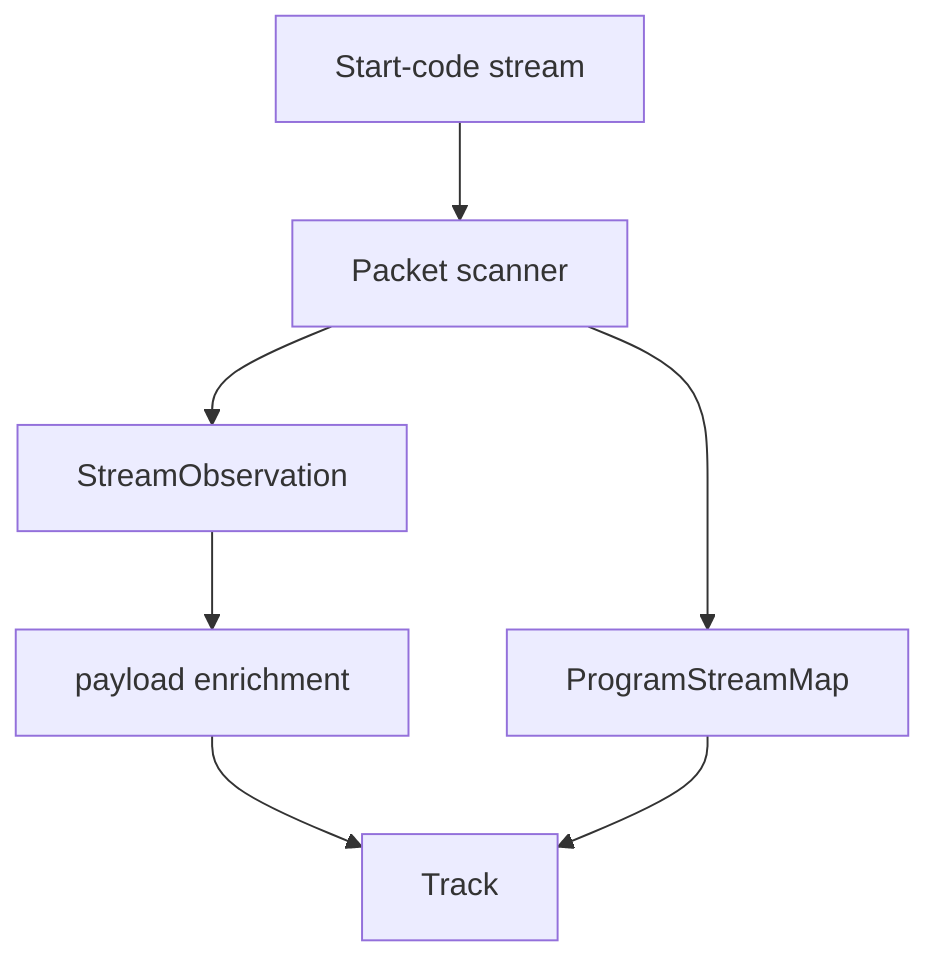

# MPEG Program Stream Parser

Implementation progress: 72%

## Purpose

The MPEG-PS parser recognises MPEG program streams and VOB-like files, discovers PES streams, uses program-stream maps when present, and enriches video/audio metadata from payload prefixes.

## Implementation

- Primary implementation: `src-tauri/src/media_metadata/mpeg_ps/reader.rs`
- Related modules: `packet.rs`, `pes.rs`, `stream_map.rs`, `identify.rs`
- Upstream basis: `../mkvtoolnix/src/input/r_mpeg_ps.cpp`, `../mkvtoolnix/src/input/r_mpeg_ps.h`

The parser scans start codes, recognises pack and system headers, parses program stream maps, discovers private-stream sub IDs, accumulates bounded payload prefixes, and classifies MPEG video, AVC, VC-1, MPEG audio, AAC, AC-3, DTS, TrueHD, LPCM, and VobSub-style private streams.

## Data Structures

Key structures are `StartCode`, `PesHeader`, `ProgramStreamMap`, `PsmEntry`, and `StreamObservation`.

## Gaps and Handling

Upstream has broader scaling probe windows, timestamp-offset calculation, multi-file VOB opening, packet delivery, and more late-stream recovery. Rust keeps bounded discovery and payload enrichment so metadata extraction remains fast and deterministic.
