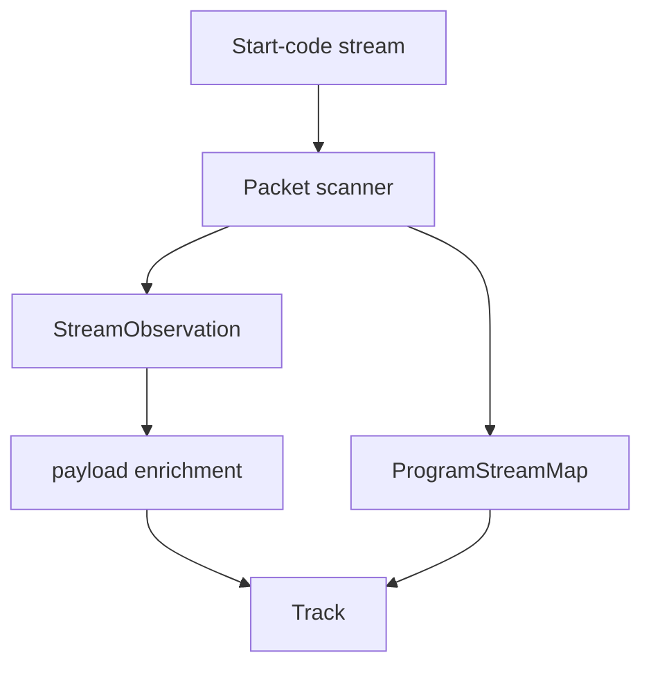

# MPEG Program Stream Parser

Implementation progress: 74%

## Purpose

The MPEG-PS parser recognises MPEG program streams and VOB-like files, discovers PES streams, uses program-stream maps when present, and enriches video/audio metadata from payload prefixes.

## Implementation

- Primary implementation: `src-tauri/src/media_metadata/mpeg_ps/reader.rs`
- Related modules: `packet.rs`, `pes.rs`, `stream_map.rs`, `identify.rs`
- Upstream basis: `../mkvtoolnix/src/input/r_mpeg_ps.cpp`, `../mkvtoolnix/src/input/r_mpeg_ps.h`

The parser scans start codes, recognises pack and system headers, parses program stream maps, discovers private-stream sub IDs, accumulates bounded payload prefixes, and classifies MPEG video, AVC, VC-1, MPEG audio, AAC, AC-3, DTS, TrueHD, LPCM, and VobSub-style private streams.

MPEG audio (bare stream ids `0xC0..0xDF`, defaulted to `A_MPEG/L3`, and PSM stream types `0x03`/`0x04`, defaulted to `A_MPEG/L2`) is relabelled to the actual Layer I / II / III once the first frame header decodes — mirroring `new_stream_a_mpeg`'s `codec = header.get_codec()` (`r_mpeg_ps.cpp`). The probe needs only a single frame header (not two), matching upstream's `find_mp3_header`, so a short bounded payload that mkvtoolnix can identify is not rejected. When no header decodes, the table default id is retained.

## Data Structures

Key structures are `StartCode`, `PesHeader`, `ProgramStreamMap`, `PsmEntry`, and `StreamObservation`.

## Gaps and Handling

Upstream has broader scaling probe windows, timestamp-offset calculation, multi-file VOB opening, packet delivery, and more late-stream recovery. Rust keeps bounded discovery and payload enrichment so metadata extraction remains fast and deterministic.

## Open Issues

### PARSER-266: Program Stream Map accepts stream types mkvmerge ignores

- Native evidence: `mpeg_ps/identify.rs::codec_from_stream_type` maps PSM stream types `0x24`, `0x82`, `0x83`, `0x84`, and `0x87` to HEVC, DTS, TrueHD, and E-AC-3.
- Upstream evidence: `mpeg_ps_reader_c::found_new_stream` only handles PSM `es_type` values `0x01`, `0x02`, `0x03`, `0x04`, `0x0f`, `0x10`, `0x11`, `0x1b`, `0x80`, and `0x81`; DTS/TrueHD/LPCM handling is driven by private-stream-1 substream ids instead.
- Impact: native metadata can emit tracks for Program Stream Map entries that mkvmerge leaves unknown and drops, causing false positives and track-count mismatches.
- Suggested fix: restrict PSM stream-type classification to the upstream switch and keep the broader codec handling on the private-substream path.
