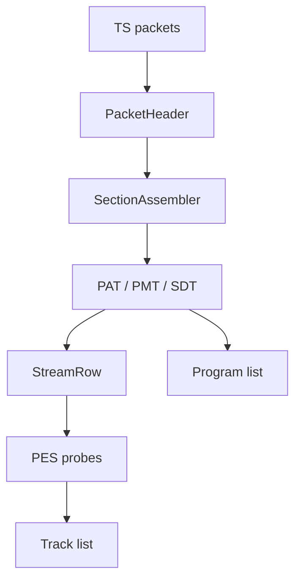

# MPEG Transport Stream Parser

Implementation progress: 84%

## Purpose

The MPEG-TS parser recognises transport streams, detects packet size, builds program and PID tables, decodes descriptors, and enriches tracks from bounded PES payloads.

## Implementation

- Primary implementation: `src-tauri/src/media_metadata/mpeg_ts/reader.rs`
- Related modules: `packet.rs`, `pat.rs`, `pmt.rs`, `pes.rs`, `stream_table.rs`, `identify.rs`, `descriptors/`
- Upstream basis: `../mkvtoolnix/src/input/r_mpeg_ts.cpp`, `../mkvtoolnix/src/input/r_mpeg_ts.h`

The parser supports 188-byte TS, 192-byte M2TS, and 204-byte FEC packet sizes. It reassembles PAT, PMT, and SDT sections, builds stream rows from stream types and descriptors, extracts language/service data, accumulates bounded PES payloads, and enriches AVC, HEVC, MPEG video, VC-1, AC-3, E-AC-3, AAC, MP3, DTS, TrueHD, LPCM, PGS, DVB subtitles, teletext, TextST, and Dolby Vision pairings.

## Data Structures

Important structures are `PacketHeader`, `SectionAssembler`, `Pat`, `Pmt`, `PmtStreamEntry`, `StreamRow`, and descriptor-specific summaries.

## Gaps and Handling

The scan is fixed and bounded, so metadata that appears very late can be missed. Upstream also performs timestamp continuity handling, CLPI-assisted source packet trimming, packet muxing, and a larger descriptor universe. Rust records the best available program/track metadata and avoids long-running payload walks.

## Open Issues

- **PARSER-206: MPEG-TS AAC probing is ADTS-only and requires only one frame.** Native maps stream types `0x0f` and `0x11` to `A_AAC`, but enrichment searches only for one ADTS sync/header. mkvtoolnix uses the AAC parser to find five consecutive frames and records the AAC multiplex type, which covers LOAS/LATM style AAC carried by stream type `0x11` and avoids accepting a lone accidental ADTS-looking header.
