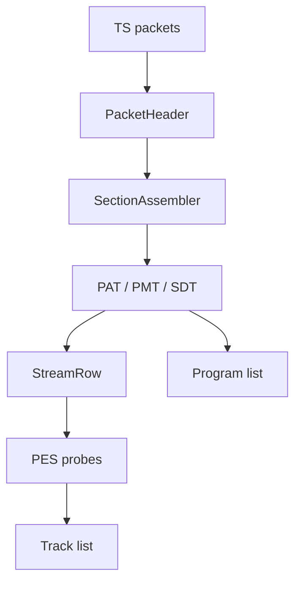

# MPEG Transport Stream Parser

Implementation progress: 85%

## Purpose

The MPEG-TS parser recognises transport streams, detects packet size, builds program and PID tables, decodes descriptors, and enriches tracks from bounded PES payloads.

## Implementation

- Primary implementation: `src-tauri/src/media_metadata/mpeg_ts/reader.rs`
- Related modules: `packet.rs`, `pat.rs`, `pmt.rs`, `pes.rs`, `stream_table.rs`, `identify.rs`, `descriptors/`
- Upstream basis: `../mkvtoolnix/src/input/r_mpeg_ts.cpp`, `../mkvtoolnix/src/input/r_mpeg_ts.h`

The parser supports 188-byte TS, 192-byte M2TS, and 204-byte FEC packet sizes. It reassembles PAT, PMT, and SDT sections, builds stream rows from stream types and descriptors, extracts language/service data, accumulates bounded PES payloads, and enriches AVC, HEVC, MPEG video, VC-1, AC-3, E-AC-3, AAC, MP3, DTS, TrueHD, LPCM, PGS, DVB subtitles, teletext, TextST, and Dolby Vision pairings.

AAC enrichment (stream types `0x0f` and `0x11`) requires five consecutive valid AAC frames in the bounded PES payload before trusting the header, mirroring `new_stream_a_aac`'s `aac::parser_c::find_consecutive_frames(buffer, size, 5)` (r_mpeg_ts.cpp:367). The shared AAC parser recognises both multiplex types — ADTS and LOAS/LATM — so the LOAS/LATM framing that stream type `0x11` commonly carries is decoded as `A_AAC`, and a lone accidental ADTS-looking sync is rejected.

## Data Structures

Important structures are `PacketHeader`, `SectionAssembler`, `Pat`, `Pmt`, `PmtStreamEntry`, `StreamRow`, and descriptor-specific summaries.

## Gaps and Handling

The scan is fixed and bounded, so metadata that appears very late can be missed. Upstream also performs timestamp continuity handling, CLPI-assisted source packet trimming, packet muxing, and a larger descriptor universe. Rust records the best available program/track metadata and avoids long-running payload walks.

## Open Issues

### PARSER-250: MPEG-TS MPEG audio keeps the table default instead of the probed layer

For stream types `0x03`/`0x04`, native initially labels the row as `A_MPEG/L3` and enrichment only copies channels and sample rate from the first MPEG audio header. mkvmerge's `new_stream_a_mpeg` decodes that header and replaces the codec with `header.get_codec()`, preserving Layer I, II, or III specialization. Native will mislabel common Layer II transport-stream audio as MP3.

### PARSER-251: Private HEVC descriptor path emits noncanonical `V_HEVC`

When a private PES stream is promoted by the HEVC descriptor, `stream_table.rs` sets `codec_id = "V_HEVC"`. The rest of the project, Matroska, MP4, MPEG-PS, and mkvmerge's HEVC codec mapping use `V_MPEGH/ISO/HEVC`. This path can leak a noncanonical codec id into public metadata and also differs from mkvmerge's PMT descriptor handling, which only promotes private streams through supported registration/subtitle/audio descriptors.
