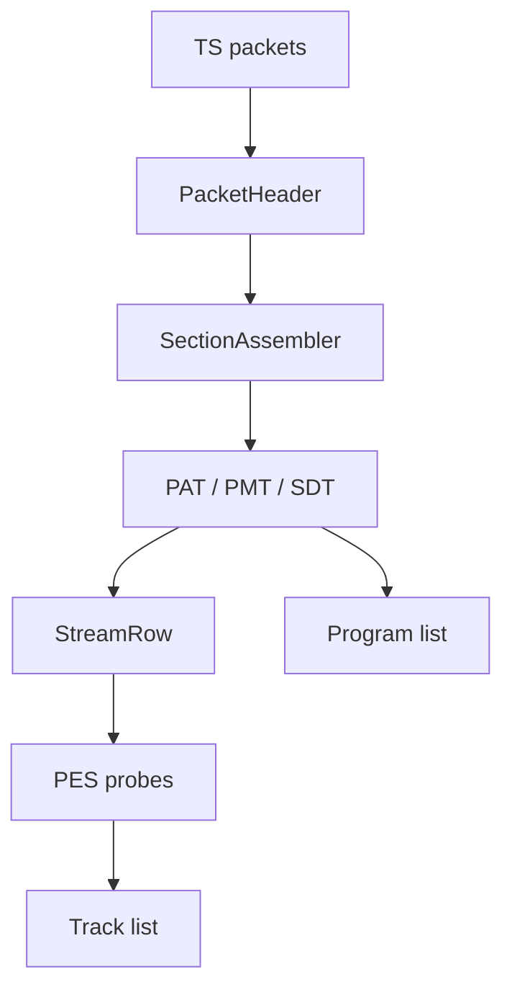

# MPEG Transport Stream Parser

Implementation progress: 92%

## Purpose

The MPEG-TS parser recognises transport streams, detects packet size, builds program and PID tables, decodes descriptors, and enriches tracks from bounded PES payloads.

## Implementation

- Primary implementation: `src-tauri/src/media_metadata/mpeg_ts/reader.rs`
- Related modules: `packet.rs`, `pat.rs`, `pmt.rs`, `pes.rs`, `stream_table.rs`, `identify.rs`, `descriptors/`
- Upstream basis: `../mkvtoolnix/src/input/r_mpeg_ts.cpp`, `../mkvtoolnix/src/input/r_mpeg_ts.h`

The parser supports 188-byte TS, 192-byte M2TS, and 204-byte FEC packet sizes. It reassembles PAT, PMT, and SDT sections, builds stream rows from stream types and descriptors, extracts language/service data, accumulates bounded PES payloads, and enriches AVC, HEVC, MPEG video, VC-1, AC-3, E-AC-3, AAC, MP3, DTS, TrueHD, LPCM, PGS, DVB subtitles, teletext, TextST, and Dolby Vision pairings.

After packet-size detection has locked onto the stream, the packet loop resynchronises if an expected sync byte is missing. It scans byte-by-byte from the failed packet position and accepts a candidate only when both that packet's sync byte and the next packet-stride sync byte are present, then resumes normal PAT/PMT/PES processing from the recovered packet (PARSER-304). A single inserted, dropped, or corrupt byte therefore no longer discards all later table and payload data.

PAT and PMT sections are validated against the PSI header flags mkvtoolnix treats as mandatory (`r_mpeg_ts.cpp:1755-1786`, `1928-1964`): `section_syntax_indicator == 1`, `current_next_indicator != 0`, `section_number == 0`, `last_section_number == 0`, and `13 <= section_length <= 1021` (PARSER-270). Inactive next-version sections and unsupported multi-section tables are rejected, so programs and stream rows are never built from a table mkvtoolnix would ignore. CRC32 is intentionally not enforced: mkvtoolnix starts with CRC validation on but disables it on its retry pass whenever a CRC failure would otherwise leave the PAT/PMT unfound (`r_mpeg_ts.cpp:1388-1394`); a header-only single-pass parser is always in that position, so tolerating a stale CRC matches the observable end-state.

Per-PID PES payloads accumulate only **elementary** bytes (PARSER-271). Mirroring `r_mpeg_ts.cpp:2147-2195` / `2394-2427`, the PES header is stripped at every payload-unit start and continuation packets are appended verbatim, so a PES header from a later packet is never injected into the probe buffer. This keeps a codec-header search (AAC five-consecutive-frame detection, AC-3/DTS sync, AVC/HEVC SPS, MPEG sequence header) intact when the data it needs spans PES boundaries.

AAC enrichment (stream types `0x0f` and `0x11`) requires five consecutive valid AAC frames in the bounded PES payload before trusting the header, mirroring `new_stream_a_aac`'s `aac::parser_c::find_consecutive_frames(buffer, size, 5)` (r_mpeg_ts.cpp:367). The shared AAC parser recognises both multiplex types — ADTS and LOAS/LATM — so the LOAS/LATM framing that stream type `0x11` commonly carries is decoded as `A_AAC`, and a lone accidental ADTS-looking sync is rejected.

MPEG audio enrichment (stream types `0x03`/`0x04`, which the PMT table defaults to `A_MPEG/L3`) decodes the first frame header and **relabels the codec to the actual layer** via the enrichment's codec override — mirroring `new_stream_a_mpeg`'s `codec = header.get_codec()` (r_mpeg_ts.cpp:354-357). Layer II transport-stream audio is therefore reported as `A_MPEG/L2`, not MP3.

HEVC video is recognised solely by stream type `0x24` (→ the canonical `V_MPEGH/ISO/HEVC`). mkvtoolnix's PMT descriptor switch (r_mpeg_ts.cpp:1864-1887) has no HEVC-descriptor (0x38) handler, so the parser does not promote a stream's codec on the HEVC descriptor; a private PES stream signalled only by an HEVC descriptor stays unknown and is dropped, exactly as upstream leaves it. No noncanonical `V_HEVC` id is emitted.

## Data Structures

Important structures are `PacketHeader`, `SectionAssembler`, `Pat`, `Pmt`, `PmtStreamEntry`, `StreamRow`, and descriptor-specific summaries.

## Gaps and Handling

The scan is fixed and bounded, so metadata that appears very late can be missed. Upstream also performs timestamp continuity handling, CLPI-assisted source packet trimming, packet muxing, and a larger descriptor universe. Rust records the best available program/track metadata and avoids long-running payload walks. PAT/PMT now reject inactive and multi-section tables, per-PID PES accumulation strips every PES header so codec probes are no longer interrupted by injected headers, and in-stream sync loss is recovered with a bounded resync scan.

## Open Issues

### PARSER-321: PMT program descriptors are applied to every stream

The PMT parser stores `program_descriptors`, `handle_pmt` walks them, and `stream_table::build_rows` uses program-level ISO-639 descriptors as a fallback language for every elementary stream. It also carries a program-level service descriptor into `StreamRow.service_name`, which can become the container program's service name. mkvtoolnix skips PMT program descriptors for stream metadata: after validating `program_info_length`, `parse_pmt` starts the descriptor reader at `program_info_end`, and `parse_pmt_pid_info` only sees per-elementary-stream descriptors. Service provider/name information is populated separately from SDT.

Impact: a PMT program descriptor can invent languages or service names on tracks/programs that mkvtoolnix would leave unset. This is a parser-purity issue because program-level data is being rewritten as per-stream metadata.
