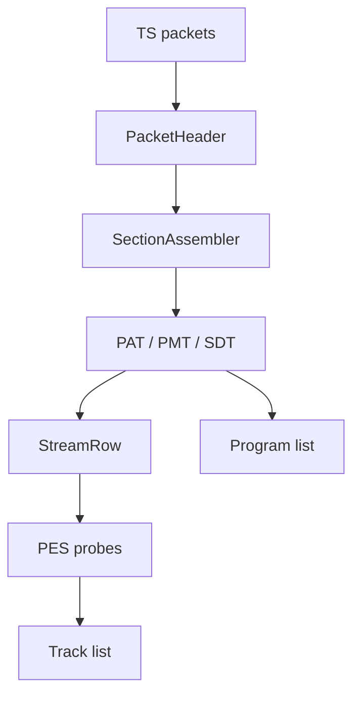

# MPEG Transport Stream Parser

Implementation progress: 87%

## Purpose

The MPEG-TS parser recognises transport streams, detects packet size, builds program and PID tables, decodes descriptors, and enriches tracks from bounded PES payloads.

## Implementation

- Primary implementation: `src-tauri/src/media_metadata/mpeg_ts/reader.rs`
- Related modules: `packet.rs`, `pat.rs`, `pmt.rs`, `pes.rs`, `stream_table.rs`, `identify.rs`, `descriptors/`
- Upstream basis: `../mkvtoolnix/src/input/r_mpeg_ts.cpp`, `../mkvtoolnix/src/input/r_mpeg_ts.h`

The parser supports 188-byte TS, 192-byte M2TS, and 204-byte FEC packet sizes. It reassembles PAT, PMT, and SDT sections, builds stream rows from stream types and descriptors, extracts language/service data, accumulates bounded PES payloads, and enriches AVC, HEVC, MPEG video, VC-1, AC-3, E-AC-3, AAC, MP3, DTS, TrueHD, LPCM, PGS, DVB subtitles, teletext, TextST, and Dolby Vision pairings.

AAC enrichment (stream types `0x0f` and `0x11`) requires five consecutive valid AAC frames in the bounded PES payload before trusting the header, mirroring `new_stream_a_aac`'s `aac::parser_c::find_consecutive_frames(buffer, size, 5)` (r_mpeg_ts.cpp:367). The shared AAC parser recognises both multiplex types — ADTS and LOAS/LATM — so the LOAS/LATM framing that stream type `0x11` commonly carries is decoded as `A_AAC`, and a lone accidental ADTS-looking sync is rejected.

MPEG audio enrichment (stream types `0x03`/`0x04`, which the PMT table defaults to `A_MPEG/L3`) decodes the first frame header and **relabels the codec to the actual layer** via the enrichment's codec override — mirroring `new_stream_a_mpeg`'s `codec = header.get_codec()` (r_mpeg_ts.cpp:354-357). Layer II transport-stream audio is therefore reported as `A_MPEG/L2`, not MP3.

HEVC video is recognised solely by stream type `0x24` (→ the canonical `V_MPEGH/ISO/HEVC`). mkvtoolnix's PMT descriptor switch (r_mpeg_ts.cpp:1864-1887) has no HEVC-descriptor (0x38) handler, so the parser does not promote a stream's codec on the HEVC descriptor; a private PES stream signalled only by an HEVC descriptor stays unknown and is dropped, exactly as upstream leaves it. No noncanonical `V_HEVC` id is emitted.

## Data Structures

Important structures are `PacketHeader`, `SectionAssembler`, `Pat`, `Pmt`, `PmtStreamEntry`, `StreamRow`, and descriptor-specific summaries.

## Gaps and Handling

The scan is fixed and bounded, so metadata that appears very late can be missed. Upstream also performs timestamp continuity handling, CLPI-assisted source packet trimming, packet muxing, and a larger descriptor universe. Rust records the best available program/track metadata and avoids long-running payload walks.
