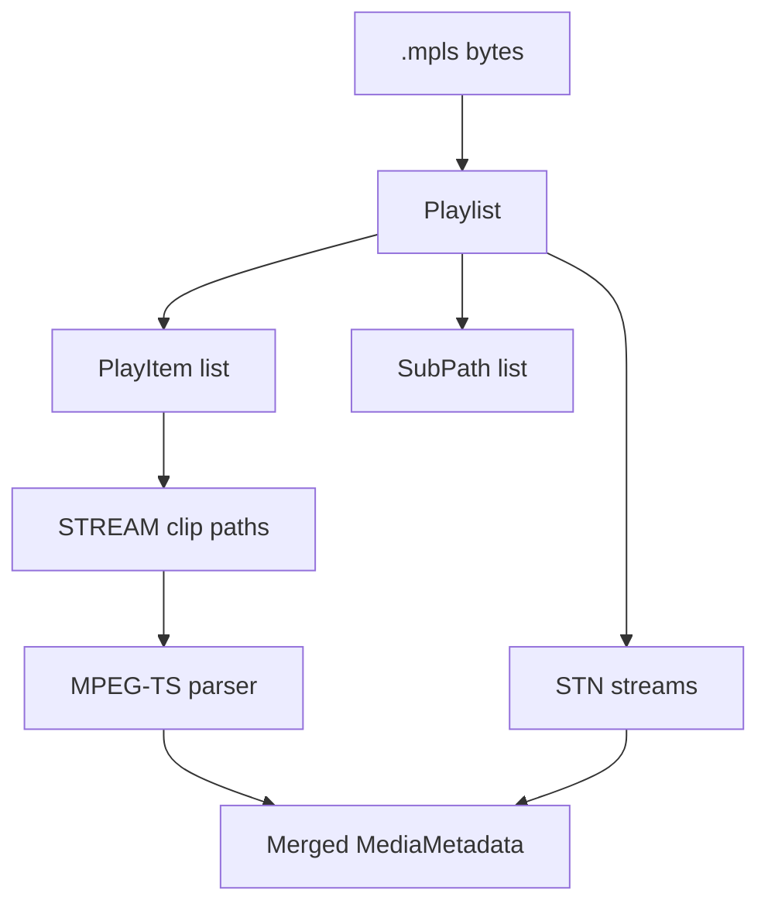

# Blu-ray MPLS Playlist Parser

Implementation progress: 90%

## Purpose

The MPLS parser recognises Blu-ray playlist files, resolves referenced stream clips, applies playlist language metadata, and delegates each segment to the MPEG-TS parser so playlist inputs produce combined media metadata.

## Implementation

- Primary implementation: `src-tauri/src/media_metadata/mpls/mod.rs`
- Binary parser: `src-tauri/src/media_metadata/mpls/parser.rs`
- Upstream basis: `../mkvtoolnix/src/common/bluray/mpls.cpp`, `../mkvtoolnix/src/common/bluray/mpls.h`, `../mkvtoolnix/src/common/mm_mpls_multi_file_io.cpp`, MPEG-TS playlist hooks in `../mkvtoolnix/src/input/r_mpeg_ts.cpp`

`parser.rs` validates the MPLS header, version, playlist offsets, play items, sub paths, sub play items, STN stream entries, and chapter marks. `mod.rs` attempts content-based playlist opening before the normal probe cascade for every input path, resolves `STREAM/*.m2ts` files, parses available segments through the MPEG-TS reader, merges tracks by PID, records playlist metadata, mirrors the playlist chapter count into the standard `MediaMetadata.chapters` summary, and applies STN languages to matching tracks (PARSER-353, PARSER-369).

## Data Structures

Key structures are `Playlist`, `PlayItem`, `SubPath`, `SubPlayItem`, `SubPlayItemClip`, and `StnStream`.

## Gaps and Handling

Rust does not use CLPI metadata, does not implement true multi-file packet IO or timestamp continuity, and does not fully surface chapter names or angle/multiclip details. If referenced segment files are missing, only playlist metadata that can be read from the MPLS file is available. Track merging is PID-based and intentionally scoped to metadata listing, but playlists with chapter marks now expose both playlist-specific chapter metadata and the standard chapter summary that mkvtoolnix reports during identification. Playlist recognition is content-based rather than extension-gated, so renamed MPLS files with resolvable Blu-ray segment files enter the same path as `.mpls` inputs.
