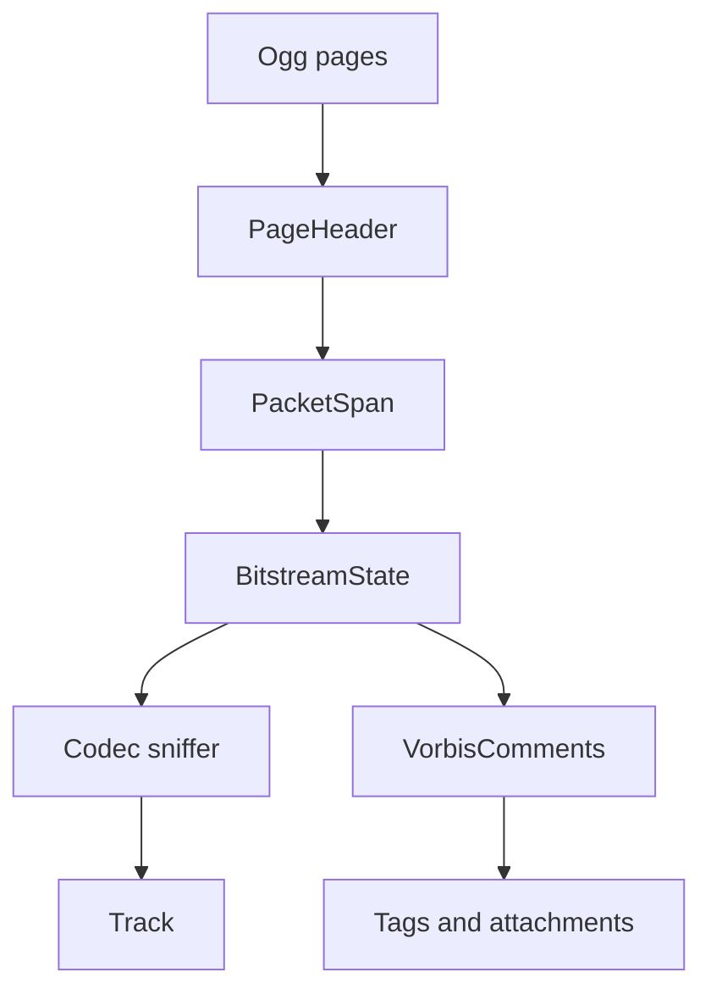

# Ogg / OGM Parser

Implementation progress: 80%

## Purpose

The Ogg parser recognises Ogg and legacy OGM containers, reconstructs header packets, detects common codecs, reads Vorbis comments, and reports tracks, tags, and cover-art attachments.

## Implementation

- Primary implementation: `src-tauri/src/media_metadata/ogg/reader.rs`
- Related modules: `src-tauri/src/media_metadata/ogg/page.rs`, `identify.rs`, `comments.rs`, `codecs/`
- Upstream basis: `../mkvtoolnix/src/input/r_ogm.cpp`, `../mkvtoolnix/src/input/r_ogm.h`, `../mkvtoolnix/src/input/r_ogm_flac.cpp`, `../mkvtoolnix/src/input/r_ogm_flac.h`

The reader parses Ogg page headers, lacing segment tables, and packet boundaries. Beginning-of-stream packets are dispatched to Vorbis, Opus, Theora, FLAC-in-Ogg, Speex, Kate, and OGM sniffers. Comment packets populate track tags, language/title hints, muxing app, chapter count, and cover-art attachments.

## Data Structures

Key structures are `PageHeader`, `PacketSpan`, `BitstreamState`, codec-specific header summaries, and `VorbisComments`.

## Gaps and Handling

The Rust parser uses bounded scans and does not perform full granule-position timing, packet muxing, or every upstream comment/chapter edge case. Kate support is intentionally lightweight, VP8-in-Ogg appears absent, and chapter parsing is simpler. The parser reports the header metadata needed for listing streams and leaves timing reconstruction to mkvmerge.
