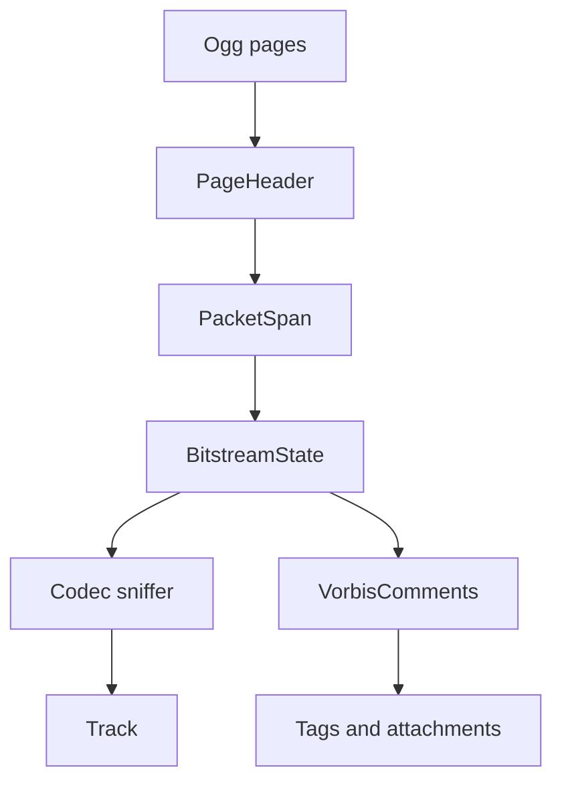

# Ogg / OGM Parser

Implementation progress: 80%

## Purpose

The Ogg parser recognises Ogg and legacy OGM containers, reconstructs header packets, detects common codecs, reads Vorbis comments, and reports tracks, tags, and cover-art attachments.

## Implementation

- Primary implementation: `src-tauri/src/media_metadata/ogg/reader.rs`
- Related modules: `src-tauri/src/media_metadata/ogg/page.rs`, `identify.rs`, `comments.rs`, `codecs/`
- Upstream basis: `../mkvtoolnix/src/input/r_ogm.cpp`, `../mkvtoolnix/src/input/r_ogm.h`, `../mkvtoolnix/src/input/r_ogm_flac.cpp`, `../mkvtoolnix/src/input/r_ogm_flac.h`

The reader parses Ogg page headers, lacing segment tables, and packet boundaries. Beginning-of-stream packets are dispatched to Vorbis, Opus, Theora, FLAC-in-Ogg, Speex, Kate, and OGM sniffers. Comment packets populate track tags, language/title hints, muxing app, chapter count, and cover-art attachments.

## Data Structures

Key structures are `PageHeader`, `PacketSpan`, `BitstreamState`, codec-specific header summaries, and `VorbisComments`.

## Gaps and Handling

The Rust parser uses bounded scans and does not perform full granule-position timing, packet muxing, or every upstream comment/chapter edge case. Kate support is intentionally lightweight, VP8-in-Ogg appears absent, and chapter parsing is simpler. The parser reports the header metadata needed for listing streams and leaves timing reconstruction to mkvmerge.

## Open Issues

- **PARSER-202: Ogg VP8 streams are not recognized.** Native sniffing covers Vorbis, Opus, Theora, FLAC, Speex, Kate, and OGM headers, but has no VP8-in-Ogg sniffer. mkvtoolnix recognizes the Ogg VP8 header, reports `V_VP8`, and extracts pixel dimensions, display dimensions, and default duration.
- **PARSER-203: Pre-1.1.1 native Ogg FLAC streams are rejected.** Native FLAC sniffing only accepts the post-1.1.1 `[0x7f]FLAC` wrapper with `fLaC` at offset 9. mkvtoolnix also accepts packets that start directly with `fLaC`.
- **PARSER-204: Ogg FLAC header count and codec private assembly are incomplete.** Native declares one FLAC header packet and stores the first packet as codec private data. mkvtoolnix reads the FLAC header packet count, waits for all FLAC header packets, strips the post-1.1.1 wrapper offset where needed, and concatenates the correct header range for the FLAC packetizer.
- **PARSER-205: Ogg Kate codec private data is truncated to the first header packet.** Native treats Kate as a one-packet header codec and stores the first packet only. mkvtoolnix keeps reading Kate header packets while the high bit is set and Xiph-laces all Kate headers into codec private data.
