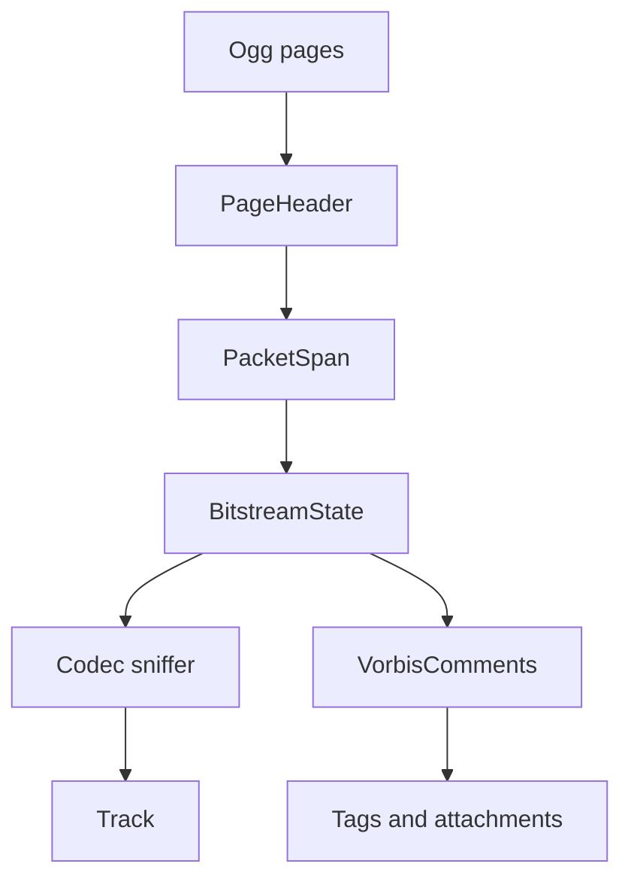

# Ogg / OGM Parser

Implementation progress: 95%

## Purpose

The Ogg parser recognises Ogg and legacy OGM containers, reconstructs header packets, detects common codecs, reads Vorbis comments, and reports tracks, tags, and cover-art attachments.

## Implementation

- Primary implementation: `src-tauri/src/media_metadata/ogg/reader.rs`
- Related modules: `src-tauri/src/media_metadata/ogg/page.rs`, `identify.rs`, `comments.rs`, `codecs/`
- Upstream basis: `../mkvtoolnix/src/input/r_ogm.cpp`, `../mkvtoolnix/src/input/r_ogm.h`, `../mkvtoolnix/src/input/r_ogm_flac.cpp`, `../mkvtoolnix/src/input/r_ogm_flac.h`

The reader parses Ogg page headers, lacing segment tables, and packet boundaries. Beginning-of-stream packets are dispatched to Vorbis, Opus, Theora, VP8-in-Ogg, FLAC-in-Ogg, Speex, Kate, and OGM sniffers. Comment packets populate track tags, language/title hints, muxing app, chapter count, and cover-art attachments.

Codec coverage and per-codec header handling:

- **VP8-in-Ogg** (`codecs/vp8.rs`) — port of `ogm_v_vp8_demuxer_c` (`r_ogm.cpp:1536-1652`) + `mtx::ogm::vp8_header_t` (`common/ogmstreams.h:103-115`). Recognises the `0x4f` + `"VP80"` mapping header, reports `V_VP8`, and extracts pixel dimensions, pixel-aspect-ratio-adjusted display dimensions, and a default duration derived from the frame rate. The optional `0x03vorbis` comment packet decodes through the generic VorbisComment path.
- **FLAC-in-Ogg** (`codecs/flac.rs`) — accepts both the post-1.1.1 `[0x7f]FLAC` wrapper (with `fLaC` at offset 9) and the pre-1.1.1 bare-`fLaC` mapping (`r_ogm.cpp:457-459`). The total header-packet count comes from the mapping's `number_of_other_header_packets` field (post-1.1.1) or is discovered by following each metadata block's "last-metadata-block" flag (pre-1.1.1) (`r_ogm_flac.cpp:238-244`). Codec private is assembled by stripping the 9-byte wrapper off the first packet and concatenating all header packets (post-1.1.1) or skipping the first packet and concatenating the rest (pre-1.1.1), mirroring `ogm_a_flac_demuxer_c::create_packetizer` (`r_ogm_flac.cpp:264-290`). Multi-packet header reads are bounded (cap of 64 header packets) to keep the header-only contract.
- **Kate** (`codecs/kate.rs`) — keeps reading header packets while the high bit of the first byte is set (`r_ogm.cpp:1707-1710`) and Xiph-laces all of them into codec private (`r_ogm.cpp:1678` → `lace_memory_xiph`), bounded by the same 64-packet cap.

## Data Structures

Key structures are `PageHeader`, `PacketSpan`, `BitstreamState`, codec-specific header summaries, and `VorbisComments`.

## Gaps and Handling

The Rust parser uses bounded scans and does not perform full granule-position timing, packet muxing, or every upstream comment/chapter edge case. VP8-in-Ogg is recognised and both FLAC-in-Ogg wrappers plus multi-packet Kate headers are fully assembled (bounded to 64 header packets); chapter parsing remains simpler. The parser reports the header metadata needed for listing streams and leaves timing reconstruction to mkvmerge.

## Open Issues

### PARSER-249: Ogg chapter comments are counted without mkvmerge's required name-pair grammar

Native chapter extraction counts every `CHAPTER\d+=timestamp` comment whose timestamp parses, regardless of whether a matching `CHAPTER\d+NAME=` line exists or appears in the expected order. mkvmerge collects all `CHAPTER*` comments, feeds them to the simple chapter parser, and that parser alternates strictly between `CHAPTERxx=...` and `CHAPTERxxNAME=...`; an unmatched timestamp at EOF does not create a chapter. Native can therefore over-report chapter counts for malformed Ogg/OGM comments that mkvmerge rejects or ignores.
