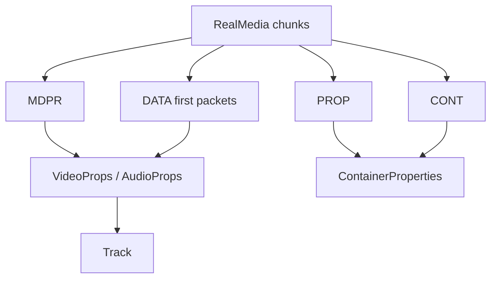

# RealMedia Parser

Implementation progress: 81%

## Purpose

The RealMedia parser recognises `.RMF` files, reads RealMedia chunks, and reports container metadata, RealVideo tracks, RealAudio tracks, and selected first-packet refinements.

## Implementation

- Primary implementation: `src-tauri/src/media_metadata/realmedia/reader.rs`
- Related modules: `src-tauri/src/media_metadata/realmedia/chunks.rs`, `stream_props.rs`
- Upstream basis: `../mkvtoolnix/src/input/r_real.cpp`, `../mkvtoolnix/src/input/r_real.h`, upstream librmff code

The reader manually parses `.RMF`, `PROP`, `CONT`, `MDPR`, and `DATA` chunks. It decodes video properties, RealAudio v3/v4/v5 headers, AAC wrapper data, `dnet` AC-3 byte-order hints, and RV40-style dimensions from first data packets when available. RealAudio AAC (`raac`/`racp`) and Cook (`cook`) FourCC classification is ASCII-case-insensitive, matching the upstream `strcasecmp` paths while preserving the original private header bytes.

For RealAudio v5 (`real_audio_v5_props_t`), the per-track extra data begins **four bytes past** the 70-byte props struct, matching mkvtoolnix's `extra_data = ts_data + 4 + sizeof(real_audio_v5_props_t)` guarded by `(sizeof(...) + 4) < ts_size` (`r_real.cpp:216-217`). Those four skipped bytes are never folded into the extra data, so the RAAC/RACP AAC wrapper's big-endian length prefix is read from the correct offset and `apply_real_aac_config` recovers the `AudioSpecificConfig` (PARSER-269).

## Data Structures

Important structures are `ChunkHeader`, `PropChunk`, `ContChunk`, `MdprChunk`, `VideoProps`, and `AudioProps`.

## Gaps and Handling

Rust is a lightweight parser rather than a full librmff implementation. It does not assemble or reorder packets, use full indexes, or scan deeply into DATA chunks. Late RealVideo and `dnet` refinements can therefore be missed. The parser records the reliable header metadata and bounded first-packet improvements only.

## Open Issues

- `PARSER-297` — The reader does not enforce librmff's strict header loop. It marks the container recognised immediately after `.RMF`, skips unknown chunks, breaks silently on short or invalid chunk headers, and still emits collected `MDPR` tracks even when mandatory `PROP` or `DATA` chunks were never accepted. `rmff_read_headers` rejects unknown headers and only succeeds after both `PROP` and `DATA`, so malformed files can be repaired or identified by Rust even though mkvtoolnix drops them.
