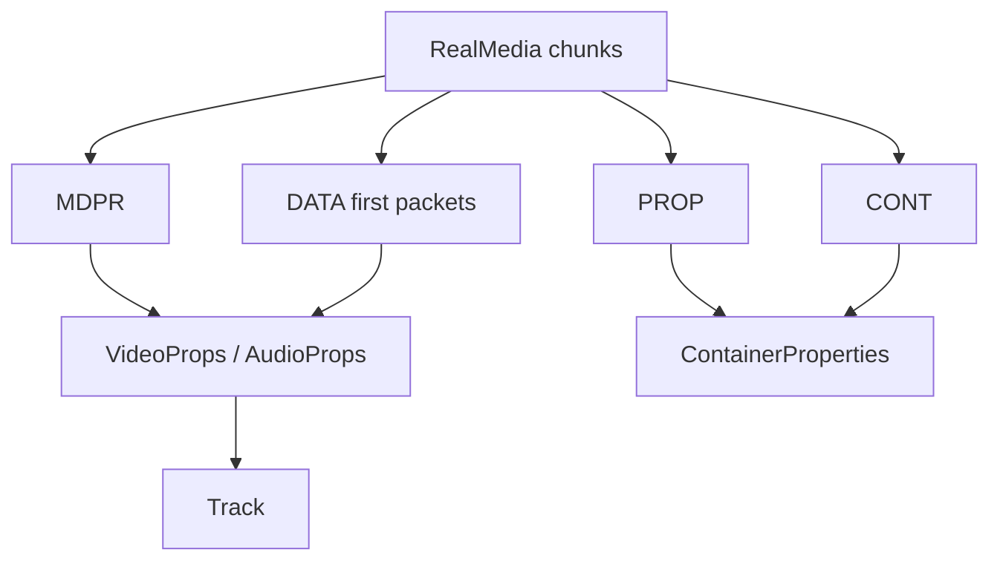

# RealMedia Parser

Implementation progress: 96%

## Purpose

The RealMedia parser recognises `.RMF` files, reads RealMedia chunks, and reports container metadata, RealVideo tracks, RealAudio tracks, and selected first-packet refinements.

## Implementation

- Primary implementation: `src-tauri/src/media_metadata/realmedia/reader.rs`
- Related modules: `src-tauri/src/media_metadata/realmedia/chunks.rs`, `stream_props.rs`
- Upstream basis: `../mkvtoolnix/src/input/r_real.cpp`, `../mkvtoolnix/src/input/r_real.h`, upstream librmff code

The reader manually parses `.RMF`, `PROP`, `CONT`, `MDPR`, and `DATA` chunks. It follows librmff's strict header loop for top-level chunks: unknown chunk IDs, truncated known chunks, common headers with impossible sizes, and trailing bytes inside known `PROP`/`CONT`/`MDPR` objects are malformed because known objects are consumed field-by-field rather than skipped to their declared object end (PARSER-297, PARSER-362). The container is only marked recognised after mandatory `PROP` and `DATA` chunks have been accepted. It decodes MDPR video properties, RealAudio v3/v4/v5 headers, AAC wrapper data, and `dnet` AC-3 byte-order hints from selected first packets. RealAudio AAC (`raac`/`racp`) and Cook (`cook`) FourCC classification is ASCII-case-insensitive, matching the upstream `strcasecmp` paths while preserving the original private header bytes (PARSER-355).

For RealAudio v5 (`real_audio_v5_props_t`), the per-track extra data begins **four bytes past** the 70-byte props struct, matching mkvtoolnix's `extra_data = ts_data + 4 + sizeof(real_audio_v5_props_t)` guarded by `(sizeof(...) + 4) < ts_size` (`r_real.cpp:216-217`). Those four skipped bytes are never folded into the extra data, so the RAAC/RACP AAC wrapper's big-endian length prefix is read from the correct offset and `apply_real_aac_config` recovers the `AudioSpecificConfig` (PARSER-269).

The DATA reader walks RealMedia packet headers directly instead of buffering a fixed-size prefix. It retains only a bounded packet prefix for each stream, but keeps scanning under the parser deadline until every `dnet` stream has a packet with the BSID byte that mkvtoolnix reads in `get_information_from_data` (`frame->data[4] >> 3`). If an early `dnet` packet is too short or uninformative, a later packet for the same stream can replace it before track construction (PARSER-316).

## Data Structures

Important structures are `ChunkHeader`, `PropChunk`, `ContChunk`, `MdprChunk`, `VideoProps`, and `AudioProps`.

## Gaps and Handling

Rust is a lightweight parser rather than a full librmff implementation. It does not assemble or reorder packets, use full indexes, or perform packet output. Video dimensions come from the MDPR header during identification, matching mkvtoolnix; the deadline-checked DATA packet walk is retained only for `dnet` BSID refinement. Other late packet-derived refinements remain out of scope. The parser records reliable header metadata and the bounded packet-prefix improvements needed for identification.
