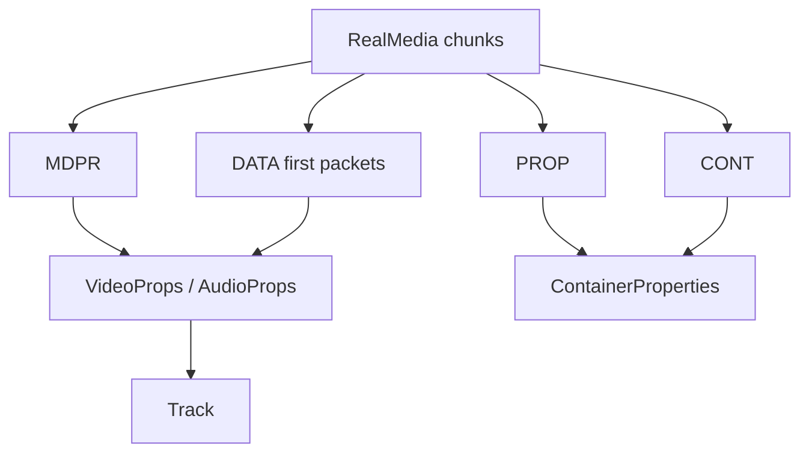

# RealMedia Parser

Implementation progress: 76%

## Purpose

The RealMedia parser recognises `.RMF` files, reads RealMedia chunks, and reports container metadata, RealVideo tracks, RealAudio tracks, and selected first-packet refinements.

## Implementation

- Primary implementation: `src-tauri/src/media_metadata/realmedia/reader.rs`
- Related modules: `src-tauri/src/media_metadata/realmedia/chunks.rs`, `stream_props.rs`
- Upstream basis: `../mkvtoolnix/src/input/r_real.cpp`, `../mkvtoolnix/src/input/r_real.h`, upstream librmff code

The reader manually parses `.RMF`, `PROP`, `CONT`, `MDPR`, and `DATA` chunks. It decodes video properties, RealAudio v3/v4/v5 headers, AAC wrapper data, `dnet` AC-3 byte-order hints, and RV40-style dimensions from first data packets when available.

## Data Structures

Important structures are `ChunkHeader`, `PropChunk`, `ContChunk`, `MdprChunk`, `VideoProps`, and `AudioProps`.

## Gaps and Handling

Rust is a lightweight parser rather than a full librmff implementation. It does not assemble or reorder packets, use full indexes, or scan deeply into DATA chunks. Late RealVideo and `dnet` refinements can therefore be missed. The parser records the reliable header metadata and bounded first-packet improvements only.

## Open Issues

### PARSER-269: RealAudio v5 AAC extra-data starts four bytes too early

`parse_v5` treats the bytes immediately after `real_audio_v5_props_t` as `AudioProps.extra_data`. mkvtoolnix skips an additional four bytes before cloning the RealAudio v5 extra data (`r_real.cpp:216-217`), so the current Rust slice is shifted four bytes ahead of the AAC wrapper.

This breaks `apply_real_aac_config`, which expects `extra_data[0..4]` to contain the big-endian AAC wrapper length and the `AudioSpecificConfig` to begin at `extra_data[5]`. For RAAC/RACP v5 streams, Rust can read the skipped field as the length prefix, fail ASC parsing, and fall back to incomplete sample-rate/channel/profile metadata that mkvtoolnix would derive from the real wrapper.

Fix by starting v5 `extra_data` at `PROPS_LEN + 4` when enough bytes are present, matching mkvtoolnix's `sizeof(real_audio_v5_props_t) + 4` offset, and add a v5 RAAC/RACP fixture that proves the ASC is parsed from the shifted position.
