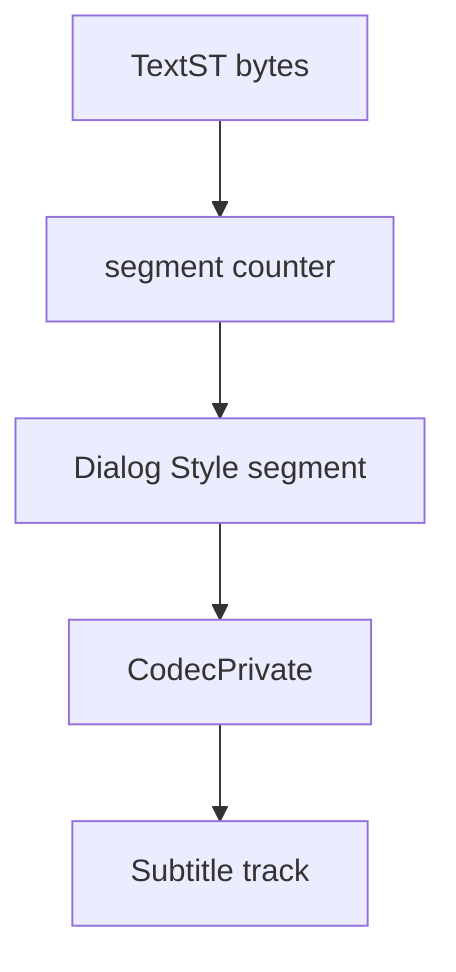

# HDMV TextST Parser

Implementation progress: 88%

## Purpose

The HDMV TextST parser recognises Blu-ray text subtitle streams, extracts the first Dialog Style segment as codec-private data, and reports one subtitle track.

## Implementation

- Primary implementation: `src-tauri/src/media_metadata/subtitles/hdmv_textst.rs`
- Upstream basis: `../mkvtoolnix/src/input/r_hdmv_textst.cpp`, `../mkvtoolnix/src/input/r_hdmv_textst.h`, upstream HDMV TextST helpers

The parser validates the `TextST` magic, walks segment headers, finds a Dialog Style segment, and stores it as codec private for the emitted `S_HDMV/TEXTST` track. Mirroring `hdmv_textst_reader_c::identify` (`r_hdmv_textst.cpp`), the track is reported as a subtitle whose payload is the Dialog Style segment; it is **not** flagged `text_subtitles` and carries no `encoding`, because the TextST character coding is part of the Blu-ray data model and is not necessarily UTF-8.

## Data Structures

The reader is implemented through segment helper functions rather than long-lived parser structs.

## Gaps and Handling

Rust does not model the two-byte frame-count boundary exactly like upstream. The codec-private header path is the important parity point and is implemented.

## Open Issues

### PARSER-268: Probe accepts truncated Dialog Style segments that mkvmerge rejects

- Native evidence: `subtitles/hdmv_textst.rs::count_segments` increments the segment count after reading the three-byte descriptor and advancing by the declared length, without checking that the declared Dialog Style payload is present in the buffer.
- Upstream evidence: `hdmv_textst_reader_c::read_segment` reads the declared payload bytes and returns no segment when the read is short; `probe_file` only accepts the file when that complete segment exists and its type is Dialog Style.
- Impact: native probing can claim a truncated TextST file that mkvmerge would not recognise, before `read_headers` later fails to extract the codec-private segment.
- Suggested fix: require `pos + SEGMENT_HEADER_LEN + seg_len <= bytes.len()` for the first Dialog Style segment and skip the two-byte frame-count boundary explicitly before walking presentation segments.
