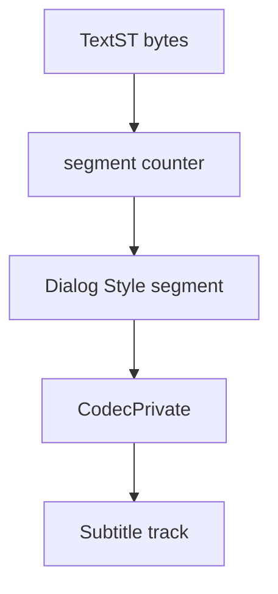

# HDMV TextST Parser

Implementation progress: 90%

## Purpose

The HDMV TextST parser recognises Blu-ray text subtitle streams, extracts the first Dialog Style segment as codec-private data, and reports one subtitle track.

## Implementation

- Primary implementation: `src-tauri/src/media_metadata/subtitles/hdmv_textst.rs`
- Upstream basis: `../mkvtoolnix/src/input/r_hdmv_textst.cpp`, `../mkvtoolnix/src/input/r_hdmv_textst.h`, upstream HDMV TextST helpers

The parser validates the `TextST` magic, requires the first Dialog Style segment to be complete, stores that segment as codec private for the emitted `S_HDMV/TEXTST` track, then skips the two-byte frame-count boundary before walking presentation segments. Mirroring `hdmv_textst_reader_c::identify` (`r_hdmv_textst.cpp`), the track is reported as a subtitle whose payload is the Dialog Style segment; it is **not** flagged `text_subtitles` and carries no `encoding`, because the TextST character coding is part of the Blu-ray data model and is not necessarily UTF-8.

## Data Structures

The reader is implemented through segment helper functions rather than long-lived parser structs.

## Gaps and Handling

The codec-private header path is the important parity point and is implemented. Packet delivery and full presentation-segment processing remain out of scope for the header-only parser.

## Open Issues

### PARSER-329: A max-size Dialog Style segment can exceed the 64 KiB TextST window

`hdmv_textst.rs` reads only `PROBE_BYTES = 64 * 1024`, requires the first Dialog Style segment to be complete within that buffer, and stores codec private by slicing the same buffer. Upstream `hdmv_textst_reader_c::read_segment` reads the 3-byte segment descriptor, allocates `segment_size + 3`, and reads exactly the declared 16-bit Dialog Style payload before storing it as codec private.

A valid Dialog Style segment can therefore require `6 + 3 + 65535` bytes from the beginning of the file, which is larger than 64 KiB. The Rust parser rejects or cannot store the full codec-private segment, while mkvtoolnix accepts and preserves it. This should be converted to descriptor-driven exact reads for the first segment rather than a fixed probe window.
