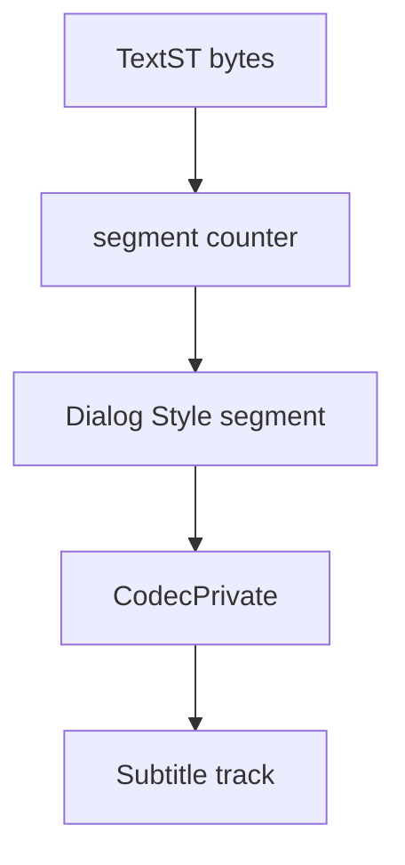

# HDMV TextST Parser

Implementation progress: 85%

## Purpose

The HDMV TextST parser recognises Blu-ray text subtitle streams, extracts the first Dialog Style segment as codec-private data, and reports one subtitle track.

## Implementation

- Primary implementation: `src-tauri/src/media_metadata/subtitles/hdmv_textst.rs`
- Upstream basis: `../mkvtoolnix/src/input/r_hdmv_textst.cpp`, `../mkvtoolnix/src/input/r_hdmv_textst.h`, upstream HDMV TextST helpers

The parser validates the `TextST` magic, walks segment headers, finds a Dialog Style segment, and stores it as codec private for the emitted `S_HDMV/TEXTST` track.

## Data Structures

The reader is implemented through segment helper functions rather than long-lived parser structs.

## Gaps and Handling

Rust does not model the two-byte frame-count boundary exactly like upstream. It also marks the subtitle text metadata as UTF-8 even though TextST character coding can vary and upstream does not expose it as simple UTF-8 text. The codec-private header path is the important parity point and is implemented.
