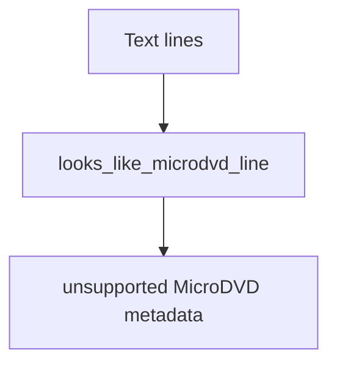

# MicroDVD Parser

Implementation progress: 92%

## Purpose

The MicroDVD parser recognises frame-based MicroDVD subtitle text and marks it as recognised but unsupported, mirroring mkvmerge's unsupported text subtitle path.

## Implementation

- Primary implementation: `src-tauri/src/media_metadata/subtitles/microdvd.rs`
- Upstream basis: `../mkvtoolnix/src/input/r_microdvd.cpp`, `../mkvtoolnix/src/input/r_microdvd.h`, `../mkvtoolnix/src/merge/reader_detection_and_creation.cpp`

The parser looks for `{start}{end}text` line shapes, sets `ContainerFormat::MicroDvd`, marks the container unsupported, and emits no tracks. Mirroring `microdvd_reader_c::probe_file`, only the **first non-empty line** — found by skipping at most 20 leading blank lines — is tested against the grammar, so ordinary prose with an incidental `{n}{m}...` line further down is not claimed.

## Data Structures

There are no parser-specific persistent structures.

## Gaps and Handling

The probe now mirrors upstream's first-non-empty-line check within a 20-line window, so it no longer over-claims ordinary text that happens to contain a `{n}{m}...` line later in the file. Since the format remains unsupported, the practical outcome is a recognised unsupported container with no extractable tracks.
