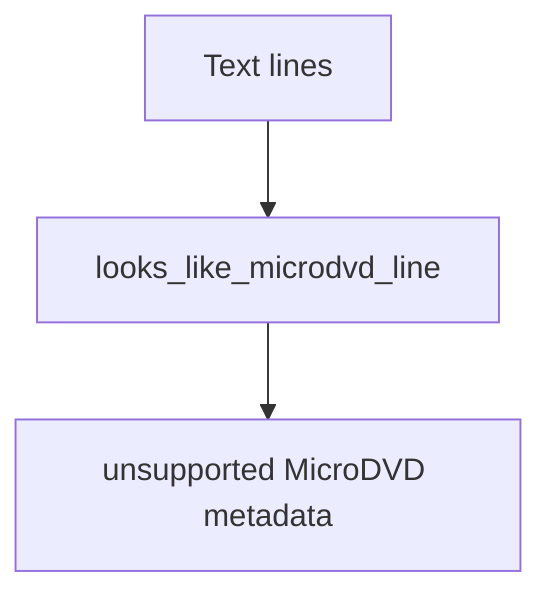

# MicroDVD Parser

Implementation progress: 88%

## Purpose

The MicroDVD parser recognises frame-based MicroDVD subtitle text and marks it as recognised but unsupported, mirroring mkvmerge's unsupported text subtitle path.

## Implementation

- Primary implementation: `src-tauri/src/media_metadata/subtitles/microdvd.rs`
- Upstream basis: `../mkvtoolnix/src/input/r_microdvd.cpp`, `../mkvtoolnix/src/input/r_microdvd.h`, `../mkvtoolnix/src/merge/reader_detection_and_creation.cpp`

The parser looks for `{start}{end}text` line shapes, sets `ContainerFormat::MicroDvd`, marks the container unsupported, and emits no tracks.

## Data Structures

There are no parser-specific persistent structures.

## Gaps and Handling

Upstream checks a smaller, more specific set of early short lines. Rust scans any matching line in the initial text window, which is more tolerant but less exact. Since the format remains unsupported, the practical outcome is still a recognised unsupported container with no extractable tracks.

## Open Issues

- `PARSER-237`: MicroDVD probing scans any matching line in the first 16 KiB. mkvmerge only checks the first non-empty line among at most 20 short lines, so ordinary text with a later `{1}{2}...` line can be reported as unsupported MicroDVD by native while mkvmerge would not claim it.
