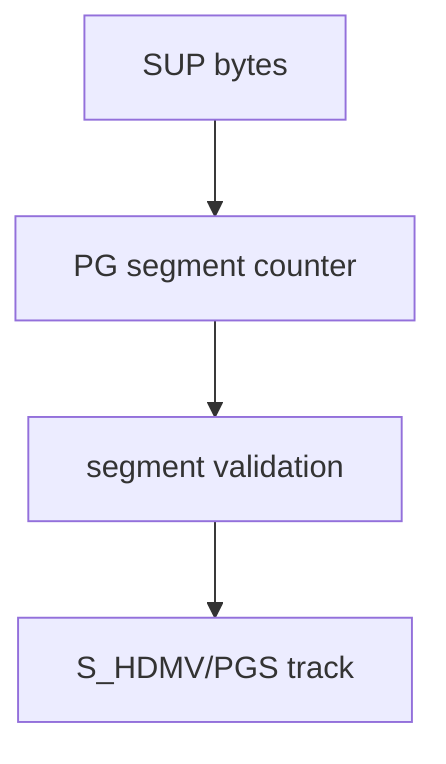

# PGS SUP Parser

Implementation progress: 93%

## Purpose

The PGS parser recognises HDMV Presentation Graphics `.sup` files and reports one graphical subtitle track with `S_HDMV/PGS` codec identity.

## Implementation

- Primary implementation: `src-tauri/src/media_metadata/subtitles/pgs.rs`
- Upstream basis: `../mkvtoolnix/src/input/r_hdmv_pgs.cpp`, `../mkvtoolnix/src/input/r_hdmv_pgs.h`, upstream HDMV PGS helpers

The parser validates the `PG` segment chain exactly as `hdmv_pgs_reader_c::probe_file` does — it checks the `PG` magic, skips each segment by its declared `segment_length`, and confirms the next segment also carries the `PG` magic. It does **not** gate on `segment_type`, so interactive-composition (`0x18`) and future segment types near the start are walked rather than rejected. Once at least two `PG`-magic segments are observed it emits a single image subtitle track.

## Data Structures

The reader uses helper functions rather than custom persistent structs.

## Gaps and Handling

The probe now matches upstream's `PG`-magic-and-length walk and no longer gates on segment type, so files carrying interactive-composition or future segment types near the start are recognised. The reader remains header-only: it counts segment headers to confirm the format but does not decode palette, object, or composition payloads.
