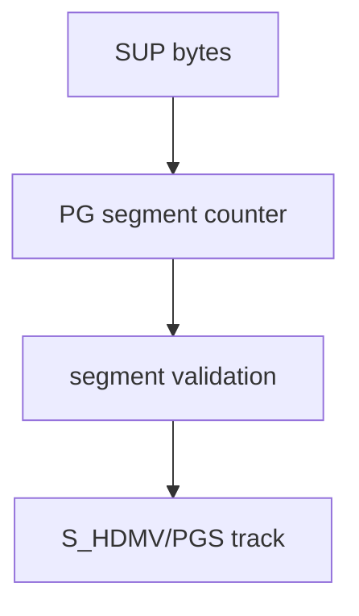

# PGS SUP Parser

Implementation progress: 90%

## Purpose

The PGS parser recognises HDMV Presentation Graphics `.sup` files and reports one graphical subtitle track with `S_HDMV/PGS` codec identity.

## Implementation

- Primary implementation: `src-tauri/src/media_metadata/subtitles/pgs.rs`
- Upstream basis: `../mkvtoolnix/src/input/r_hdmv_pgs.cpp`, `../mkvtoolnix/src/input/r_hdmv_pgs.h`, upstream HDMV PGS helpers

The parser validates the `PG` segment chain, checks segment sizes and known segment types, counts plausible segments, and emits a single image subtitle track.

## Data Structures

The reader uses helper functions rather than custom persistent structs.

## Gaps and Handling

The Rust probe is stricter than upstream and currently omits a valid upstream interactive-composition segment type. This can create false negatives for edge files, but accepted files have complete header-level metadata for this app.
