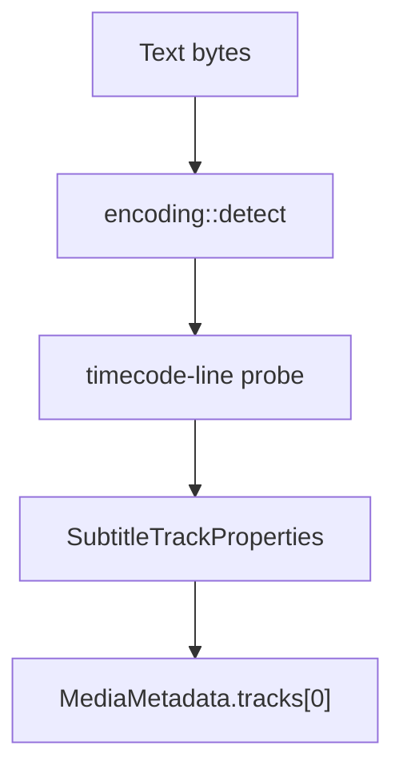

# SRT Parser

Implementation progress: 82%

## Purpose

The SRT parser recognises SubRip text subtitle files and reports one UTF-8 subtitle track with encoding metadata. Empty `.srt` files are accepted through the extension fallback so they match mkvmerge's handling.

## Implementation

- Primary implementation: `src-tauri/src/media_metadata/subtitles/srt.rs`
- Encoding helper: `src-tauri/src/media_metadata/subtitles/encoding.rs`
- Upstream basis: `../mkvtoolnix/src/input/r_srt.cpp`, `../mkvtoolnix/src/input/r_srt.h`, upstream text subtitle helpers, and `../mkvtoolnix/src/merge/reader_detection_and_creation.cpp`

The reader decodes an initial text window with BOM and configured charset support, searches for SRT timecode lines, records the detected encoding, and emits `S_TEXT/UTF8` metadata. `populate_empty_srt` supports the explicit empty-file path used by the dispatcher.

## Data Structures

SRT is represented directly through the shared track model; helper functions perform timecode classification.

## Gaps and Handling

Upstream expects the first non-empty line to be a numeric subtitle index followed by a timestamp line. Rust accepts any recognised timecode line in the probe window. That is more tolerant for damaged files but less exact. The timestamp grammar is also not text-identical to upstream. The parser reports stable single-track metadata and leaves cue-level validation outside the current model.

## Open Issues

### PARSER-223: SRT probe accepts any timestamp line in the probe window

Native `has_srt_timecode_line()` scans every line in the first 16 KiB and accepts a line shaped like an SRT timestamp (`src-tauri/src/media_metadata/subtitles/srt.rs:47-68`). Upstream strips leading blank lines, requires the first non-empty line to parse as a numeric cue index, and only then tests the next line with the timestamp regex (`../mkvtoolnix/src/input/subtitles.cpp:106-124`). Text files containing an incidental timestamp line can therefore be classified as SRT natively when mkvmerge would reject them.
