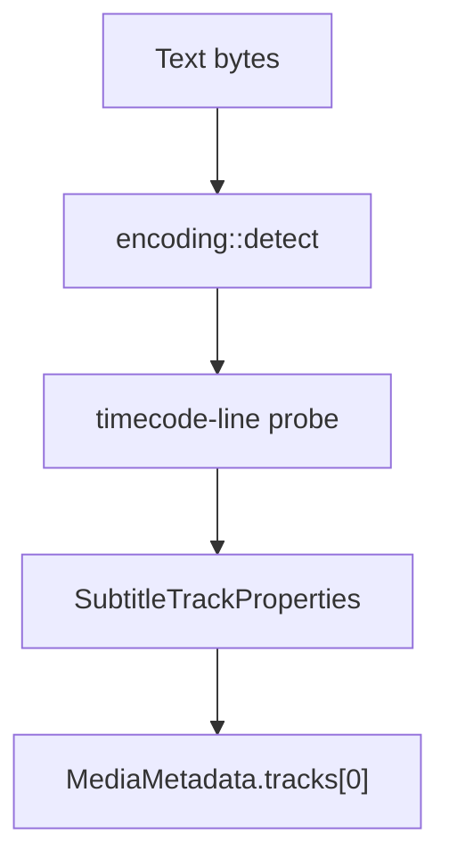

# SRT Parser

Implementation progress: 100%

## Purpose

The SRT parser recognises SubRip text subtitle files and reports one UTF-8 subtitle track with encoding metadata. Empty `.srt` files are accepted through the extension fallback so they match mkvmerge's handling.

## Implementation

- Primary implementation: `src-tauri/src/media_metadata/subtitles/srt.rs`
- Encoding helper: `src-tauri/src/media_metadata/subtitles/encoding.rs`
- Upstream basis: `../mkvtoolnix/src/input/r_srt.cpp`, `../mkvtoolnix/src/input/r_srt.h`, upstream text subtitle helpers, and `../mkvtoolnix/src/merge/reader_detection_and_creation.cpp`

The reader decodes the text stream with BOM and configured charset support, then checks SRT structure exactly as `srt_parser_c::probe` does: it skips leading blank lines, requires the first non-empty line to parse as a numeric cue index, and only then tests the immediately following line against the SRT timecode grammar (`looks_like_srt`). The probe path uses mkvtoolnix-style bounded line reads instead of loading the whole file: leading blank/index reads are capped like `getline(10)`, the timestamp line is capped like `getline(100)`, one follow-up line is consumed, and the cursor is rewound (PARSER-396). The header read still decodes the complete file under the parser deadline, so files with long leading blank regions classify like mkvtoolnix once the SRT reader has claimed them. It records the detected encoding and emits `S_TEXT/UTF8` metadata. The whole-line scanner `has_srt_timecode_line` is retained for classifying already-extracted subtitle payloads (e.g. AVI GAB2), not for whole-file probing. `populate_empty_srt` supports the explicit empty-file path used by the dispatcher.

## Data Structures

SRT is represented directly through the shared track model; helper functions perform timecode classification.

## Gaps and Handling

The probe now matches upstream's bounded index-line-then-timestamp-line structure, so text files containing an incidental timestamp line are no longer misclassified as SRT and large non-SRT files are not fully loaded during probing. The timestamp grammar is a faithful port of upstream's `SRT_RE_TIMESTAMP_LINE` regex: each numeric field allows leading whitespace and an optional sign (`\s*(-?)\s*(\d+)`), the millisecond separator may be `,`, `.`, or `:`, and the arrow accepts any non-empty run of dashes/spaces before `>` (so `00:00:01,000-->00:00:02,000`, `00:00:01,000 -> 00:00:02,000`, and extra-spaced forms all match). The pattern is anchored at the start but not the end, so trailing content (e.g. coordinate annotations) is tolerated. Cue-level parsing and per-entry validation remain outside the current single-track model.
