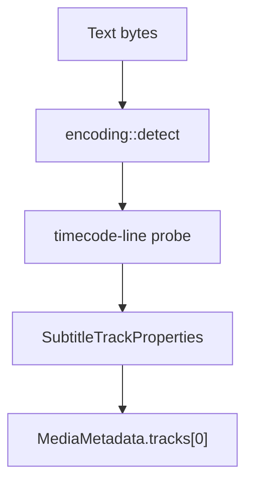

# SRT Parser

Implementation progress: 90%

## Purpose

The SRT parser recognises SubRip text subtitle files and reports one UTF-8 subtitle track with encoding metadata. Empty `.srt` files are accepted through the extension fallback so they match mkvmerge's handling.

## Implementation

- Primary implementation: `src-tauri/src/media_metadata/subtitles/srt.rs`
- Encoding helper: `src-tauri/src/media_metadata/subtitles/encoding.rs`
- Upstream basis: `../mkvtoolnix/src/input/r_srt.cpp`, `../mkvtoolnix/src/input/r_srt.h`, upstream text subtitle helpers, and `../mkvtoolnix/src/merge/reader_detection_and_creation.cpp`

The reader decodes an initial text window with BOM and configured charset support, then probes for SRT structure exactly as `srt_parser_c::probe` does: it skips leading blank lines, requires the first non-empty line to parse as a numeric cue index, and only then tests the immediately following line against the SRT timecode grammar (`looks_like_srt`). It records the detected encoding and emits `S_TEXT/UTF8` metadata. The whole-line scanner `has_srt_timecode_line` is retained for classifying already-extracted subtitle payloads (e.g. AVI GAB2), not for whole-file probing. `populate_empty_srt` supports the explicit empty-file path used by the dispatcher.

## Data Structures

SRT is represented directly through the shared track model; helper functions perform timecode classification.

## Gaps and Handling

The probe now matches upstream's index-line-then-timestamp-line structure, so text files containing an incidental timestamp line are no longer misclassified as SRT. The timestamp grammar itself is still not byte-identical to upstream's regex (the arrow form is matched on `" --> "` rather than the looser `[\-\s]+>`), and cue-level validation remains outside the current single-track model.
