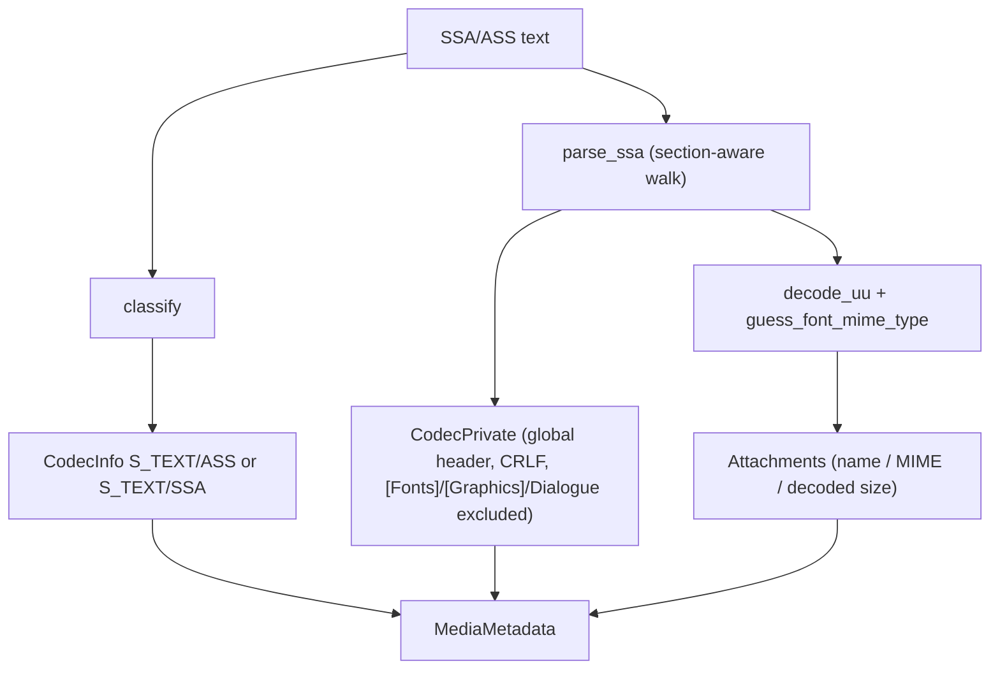

# SSA / ASS Parser

Implementation progress: 96%

## Purpose

The SSA/ASS parser recognises SubStation Alpha and Advanced SubStation Alpha subtitle files. It reports one text subtitle track, global header codec-private data, encoding metadata, and embedded font attachment summaries when present.

## Implementation

- Primary implementation: `src-tauri/src/media_metadata/subtitles/ssa.rs`
- Encoding helper: `src-tauri/src/media_metadata/subtitles/encoding.rs`
- Upstream basis: `../mkvtoolnix/src/input/r_ssa.cpp`, `../mkvtoolnix/src/input/r_ssa.h`, upstream text subtitle helpers

`classify` mirrors `ssa_parser_c::probe` (`../mkvtoolnix/src/input/subtitles.cpp:305-338`): it inspects the first non-comment, non-empty line (within the first 100 lines, skipping `^\s*$` blanks and `^\s*[!;]` comments) and claims the file only when that line is a `[Script Info]` or `[V4(+)? Styles]` section header. The SSA-vs-ASS distinction then follows `ssa_parser_c::parse`'s `m_is_ass` flag — it defaults to **SSA** and is promoted to ASS by a `ScriptType: v4.00+` line or a `[V4+ Styles]` section. Section-header matching is a faithful port of the upstream `^\s*\[Name\]` regexes: words are separated by `\s+`, so spacing variants such as `[Script   Info]` and `[V4+    Styles]` are accepted, and trailing content after `]` is tolerated. `parse_ssa` is a single-pass, section-aware port of `ssa_parser_c::parse` (`../mkvtoolnix/src/input/subtitles.cpp:354`). It walks the file line by line tracking the current `[...]` section and builds two outputs at once:

- the **global header** (codec-private data), assembled CRLF-by-line exactly like upstream's `m_global += line + "\r\n"`. Lines belonging to the embedded-media sections (`[Fonts]` / `[Graphics]`, including their section headers) and `Dialogue:` lines inside `[Events]` are excluded; `Format:` lines and the script-info / styles content are kept.
- the **attachments** harvested from `[Fonts]` and `[Graphics]`. A `fontname:` line names the next attachment; subsequent lines accumulate its UU-encoded payload; the payload is flushed whenever the section changes or a new `fontname:` arrives (mirroring upstream's `add_attachment_maybe` on the previous section). On flush the payload is UU-decoded (`decode_uu`, a port of `decode_chars`), the **decoded** byte count becomes the attachment size, and the MIME type is guessed from the decoded bytes.

## Data Structures

The main local enum is `SsaVariant`; the internal `SsaSection` enum mirrors upstream's `ssa_section_e`; attachments use the shared `Attachment` model.

## Gaps and Handling

The probe and the SSA/ASS classification now match upstream: the first meaningful line gate, the `\s+`-tolerant section-name regexes, the comment/blank skipping, and the SSA-by-default `m_is_ass` semantics are all ported, so a bare `[Script Info]` file is reported as SSA (not ASS) and a `ScriptType:`/styles marker that appears only after non-SSA content no longer claims the file.

MIME guessing is content-based but not Qt-backed. mkvtoolnix delegates `guess_type_for_data` to Qt's `QMimeDatabase` (the freedesktop shared-mime-info magic database), which cannot be linked into this header-only port. Instead `guess_font_mime_type` reimplements the byte-signature subset the font/graphics attachments actually rely on — TrueType sfnt (`00 01 00 00`, `true`, `typ1` → `font/sfnt`), OpenType CFF (`OTTO` → `font/otf`), TrueType collection (`ttcf` → `font/collection`), WOFF/WOFF2 (`wOFF`/`wOF2`), and the common raster image types (PNG, JPEG, GIF, BMP) — and applies the same default `current`-mode font-MIME remapping mkvmerge uses (the legacy names are only emitted under `--engage use_legacy_font_mime_types`, which this port does not expose). Unrecognised payloads fall back to `application/octet-stream`, matching `QMimeDatabase`'s default. Exotic image formats Qt would recognise from deeper magic (e.g. TIFF, WebP, less common bitmap variants) are not in the subset; embedded fonts/graphics in the wild are overwhelmingly the types listed above.
