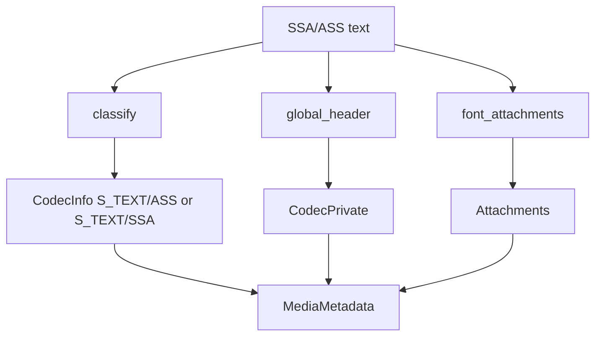

# SSA / ASS Parser

Implementation progress: 72%

## Purpose

The SSA/ASS parser recognises SubStation Alpha and Advanced SubStation Alpha subtitle files. It reports one text subtitle track, global header codec-private data, encoding metadata, and embedded font attachment summaries when present.

## Implementation

- Primary implementation: `src-tauri/src/media_metadata/subtitles/ssa.rs`
- Encoding helper: `src-tauri/src/media_metadata/subtitles/encoding.rs`
- Upstream basis: `../mkvtoolnix/src/input/r_ssa.cpp`, `../mkvtoolnix/src/input/r_ssa.h`, upstream text subtitle helpers

The parser classifies ASS versus SSA by `[V4+ Styles]`, `[V4 Styles]`, and `ScriptType` markers. `global_header` extracts the script header before events, while `font_attachments` scans embedded font blocks and surfaces attachment metadata.

## Data Structures

The main local enum is `SsaVariant`; attachments use the shared `Attachment` model.

## Gaps and Handling

The probe grammar and classification order differ from upstream. A `[Script Info]`-only file can classify differently, global header formatting is not CRLF/exclusion-equivalent, and embedded fonts are not UU-decoded or MIME-guessed with mkvmerge-level fidelity. The parser still exposes the track and attachment intent so the UI can list the available items.
