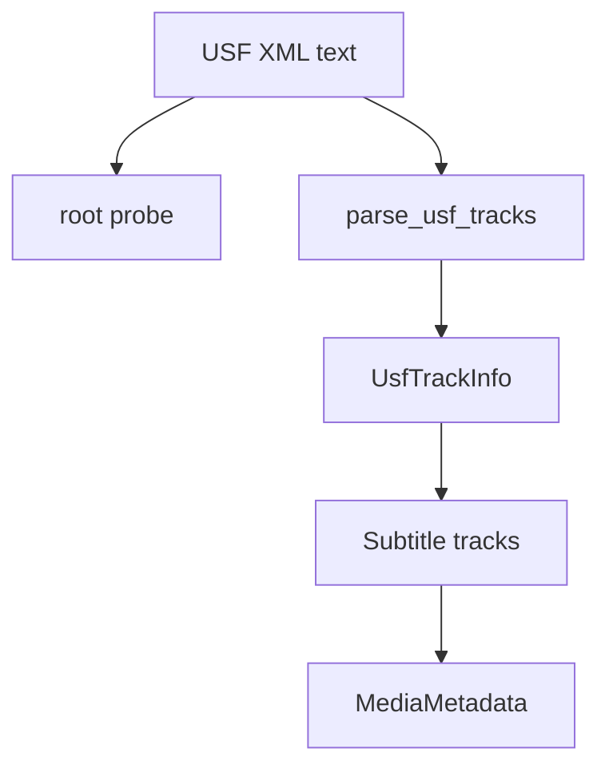

# USF Parser

Implementation progress: 45%

## Purpose

The USF parser recognises Universal Subtitle Format XML files and reports one or more text subtitle tracks with basic language and name metadata.

## Implementation

- Primary implementation: `src-tauri/src/media_metadata/subtitles/usf.rs`
- Encoding helper: `src-tauri/src/media_metadata/subtitles/encoding.rs`
- Upstream basis: `../mkvtoolnix/src/input/r_usf.cpp`, `../mkvtoolnix/src/input/r_usf.h`

The reader performs lightweight text probing for a `<USFSubtitles` root, scans `<subtitles>` elements, extracts simple inline attributes, and emits one `S_TEXT/USF` track per discovered subtitle element.

## Data Structures

`UsfTrackInfo` holds the local track name and language found during the lightweight scan.

## Gaps and Handling

Unlike upstream, Rust does not use a full XML parser or validate the full document. It misses default language metadata from `<metadata>`, child language elements, and the upstream codec-private shape, which should be the full XML minus subtitle payloads. This parser is therefore a skeleton that identifies USF files and track count but does not yet match mkvmerge's richer USF metadata behavior.

## Open Issues

- **PARSER-208: USF probing and header reading are string-prefix based and bounded to 64 KiB.** Native accepts a bare `<USFSubtitles` root after optional whitespace/XML declaration/comments and reads only the first 64 KiB. mkvtoolnix requires `<?xml` or `<!--` in the probe window, loads the XML document, validates the root element with an XML parser, and reads the document for headers.
- **PARSER-209: USF language extraction and codec private data use the wrong XML shape.** Native reads `lang`, `xml:lang`, or `language` attributes from `<subtitles>` or the root and stores only the opening tag as per-track codec private data. mkvtoolnix reads the default language from `<metadata><language code="">`, per-track language from a child `<language code="">` under `<subtitles>`, and creates one shared codec private XML document with all `<subtitles>` nodes removed.
