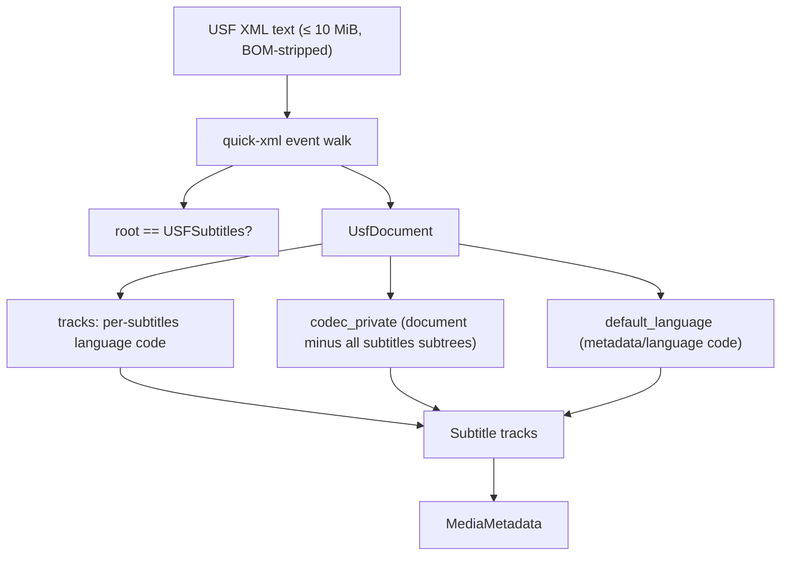

# USF Parser

Implementation progress: 96%

## Purpose

The USF parser recognises Universal Subtitle Format XML files and reports one text subtitle track per `<subtitles>` element, carrying the per-track and default-language metadata and the shared codec-private document.

## Implementation

- Primary implementation: `src-tauri/src/media_metadata/subtitles/usf.rs`
- Encoding helper: `src-tauri/src/media_metadata/subtitles/encoding.rs`
- XML engine: `quick-xml` (`=0.39.2`), the event-based stand-in for upstream's pugixml
- Upstream basis: `../mkvtoolnix/src/input/r_usf.cpp`, `../mkvtoolnix/src/input/r_usf.h`

Probing mirrors `usf_reader_c::probe_file` (r_usf.cpp lines 35-47): only the leading **~1000-character** window is inspected for an `<?xml` or `<!--` marker (upstream's `while (content.length() < 1000) getline2(...)` accumulation), then the document is parsed with a real XML engine and the document (root) element's **fully-qualified** name is validated to be exactly `USFSubtitles`. The qualified-name check keeps any namespace prefix, so a namespaced root such as `<usf:USFSubtitles>` is rejected — matching pugixml's `document_element().name()`. The document read is bounded at **10 MiB**, matching upstream's `mtx::xml::load_file(..., 10 * 1024 * 1024)` cap (r_usf.cpp line 45).

`read_headers` performs the same three-step walk as upstream:

- `parse_metadata` (r_usf.cpp lines 79-90) — the default language is read from `<metadata><language code="">` directly under the root.
- `parse_subtitles` (r_usf.cpp lines 93-137) — one `S_TEXT/USF` track per direct-child `<subtitles>` element of the root; each track's language comes from a child `<language code="">`.
- `create_codec_private` (r_usf.cpp lines 140-148) — every `<subtitles>` subtree is removed from the document, and the remainder is re-serialized as the single shared codec-private blob handed to every track.

The default-language fallback for tracks lacking a valid language mirrors the loop in `usf_reader_c::read_headers` (r_usf.cpp lines 64-65). Language codes are only stored when they resolve to a valid language; invalid default or per-track codes are ignored instead of being repaired to `und` (PARSER-361).

## Data Structures

`UsfDocument` is produced by a single event pass: it validates the root, collects the default language and per-track language codes, and re-serializes the document with every `<subtitles>` subtree dropped for the shared codec private.

## Gaps and Handling

The reader is header-only: it does not decode subtitle entry text, timestamps, or byte sizes (these only matter to the upstream packetizer/extraction path, not identification). An unbalanced/malformed document is rejected as `Unrecognised`. The root element is matched against its fully-qualified name, so namespaced roots are rejected exactly as upstream does; the deeper `<subtitles>` / `<language>` / `<metadata>` walk still uses local names, which is harmless because those elements appear unprefixed in practice.

## Open Issues

- `PARSER-374` — the 10 MiB XML cap is applied to `read_headers` as well as probing. Upstream caps only `probe_file` (`load_file(..., 10 * 1024 * 1024)`) and then reloads the full document in `read_headers` without that size limit (`r_usf.cpp:45, 53`), so large USF files can lose later `<subtitles>` tracks or be rejected locally while mkvtoolnix parses the full header document.
