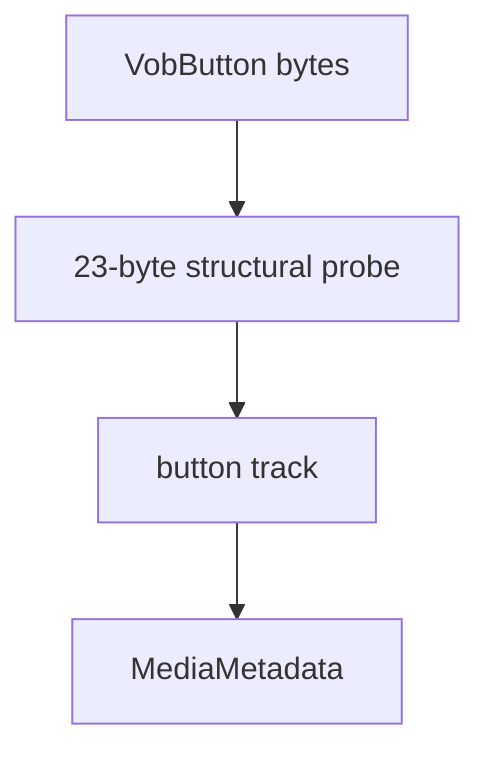

# VobButton Parser

Implementation progress: 98%

## Purpose

The VobButton parser recognises DVD button streams and reports a button track with codec identity and fixed button-plane dimensions.

## Implementation

- Primary implementation: `src-tauri/src/media_metadata/subtitles/vobbtn.rs`
- Upstream basis: `../mkvtoolnix/src/input/r_vobbtn.cpp`, `../mkvtoolnix/src/input/r_vobbtn.h`

The reader performs the same structural check as upstream: `butonDVD` magic, PES private-stream marker, and expected header layout. It emits a `TrackType::Buttons` track with `B_VOBBTN`.

## Data Structures

No parser-specific persistent data structure is needed.

## Gaps and Handling

The only meaningful differences are display naming (`VobButton` versus upstream `VobBtn`) and packet-read cursor setup, which matters only during muxing. Header-identification metadata parity is otherwise essentially complete.

## Open Issues

- `PARSER-388` - the VobButton probe is ordered too early relative to mkvtoolnix's 64-frame raw-audio loop. Upstream tries the 64-frame MP3/AC-3/AAC scans after MPEG-TS/MPEG-PS/OBU and only then tries TrueHD, loose DTS, and VobButton. The Rust dispatcher places `LATE_AMBIGUOUS_READERS` before `RAW_AUDIO_SIXTY_FOUR_FRAME_READERS`, so VobButton can claim a file that mkvtoolnix would have stopped on as raw audio first.
