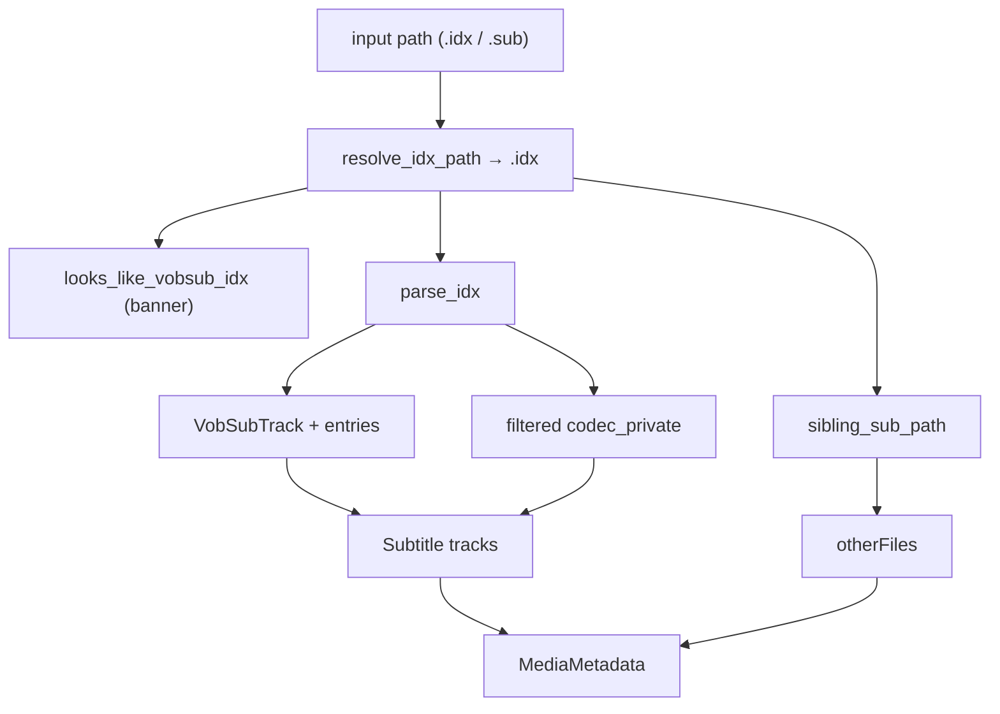

# VobSub IDX Parser

Implementation progress: 100%

## Purpose

The VobSub parser recognises `.idx` manifests, records the sibling `.sub` file when present, and reports one image subtitle track per language entry.

## Implementation

- Primary implementation: `src-tauri/src/media_metadata/subtitles/vobsub.rs`
- Upstream basis: `../mkvtoolnix/src/input/r_vobsub.cpp`, `../mkvtoolnix/src/input/r_vobsub.h`, `../mkvtoolnix/src/common/vobsub.cpp`, `../mkvtoolnix/src/common/vobsub.h`

The parser is resolved by *path* before the content cascade: both `.idx` and `.sub` inputs map to the canonical `.idx` (mirroring mkvtoolnix's `idx_and_sub_file_names`), so dragging a `.sub` produces the same listing as its `.idx`. It checks the VobSub index-file banner, reads the complete manifest, parses it into per-`id:` track entry lists, resolves the sibling `.sub` data file, records it under `container.properties.other_files`, and emits one `S_VOBSUB` track per non-empty entry list. The `.sub` MPEG-PS payload is never demuxed — only located and recorded.

## Data Structures

`parse_idx` returns a list of `VobSubTrack` (language + `VobSubEntry` list of `{position, timestamp}`) plus the shared `codec_private` text. `parse_idx` is a direct port of `vobsub_reader_c::parse_headers` (`r_vobsub.cpp:193-352`): it accumulates `delay:` per track and treats malformed delay timestamps as hard malformed-manifest errors, parses `timestamp: HH:MM:SS:mmm, filepos: 0xNN` entries (the third colon is the millisecond separator, matching `parse_timestamp` in `parsing.cpp:154-155`), applies negative-delay clamp-forward correction, skips entries that stay negative, flags out-of-order tracks for a stable sort by timestamp, drops tracks that end up with zero entries, and treats a `timestamp:` line before any `id:` track as a hard malformed-manifest error like upstream (PARSER-382).

## Path resolution and dispatch

VobSub is intercepted by path in `media_metadata::parse_with_extension_fallback` *before* the content cascade. `is_vobsub_candidate_path` matches only `.idx` and `.sub` extensions; `subtitles::vobsub::try_open_by_path` then resolves the `.idx` (`resolve_idx_path`), and only claims the file when that `.idx` exists and carries the banner. A `.sub` with no banner-bearing sibling `.idx` (e.g. a MicroDVD `.sub`) declines and the normal cascade runs, so no other reader's inputs are stolen. Renamed manifests without `.idx` or `.sub` extensions are not content-probed as VobSub, matching `vobsub_reader_c::probe_file`'s extension gate (PARSER-383). The `.sub` data file is located and recorded under `container.properties.other_files` but never demuxed.

Once the banner confirms the file is VobSub, the path-aware entry points enforce the same hard checks `vobsub_reader_c::read_headers` performs (`r_vobsub.cpp:108-132`): the sibling `.sub` data file **must** exist (`require_sibling_sub`, PARSER-232) and the manifest version **must** be 7 or newer (`require_supported_version`, PARSER-233). A missing `.sub` surfaces as an `Io`/`NotFound` error, and a missing-version or pre-v7 banner surfaces as a `Malformed` error carrying the upstream "Only v7 and newer" message — neither falls through to unrelated readers.

## Codec private

Codec private is built from the filtered `idx_data`: the per-track control lines `id:`, `timestamp:`, `delay:`, `alt:` and `langidx:` are removed, and `#` comment / blank lines are skipped, leaving the global settings lines (`size:`, `palette:`, ...) shared across every track — matching mkvtoolnix's `idx_data`.

## Gaps and Handling

Header-only: the `.sub` MPEG-PS payload is never demuxed, so per-entry SPU durations and `spu_size`/`overhead` accounting from `extract_one_spu_packet` are not computed. The `.idx` manifest itself is parsed through EOF, matching mkvtoolnix's line loop.
