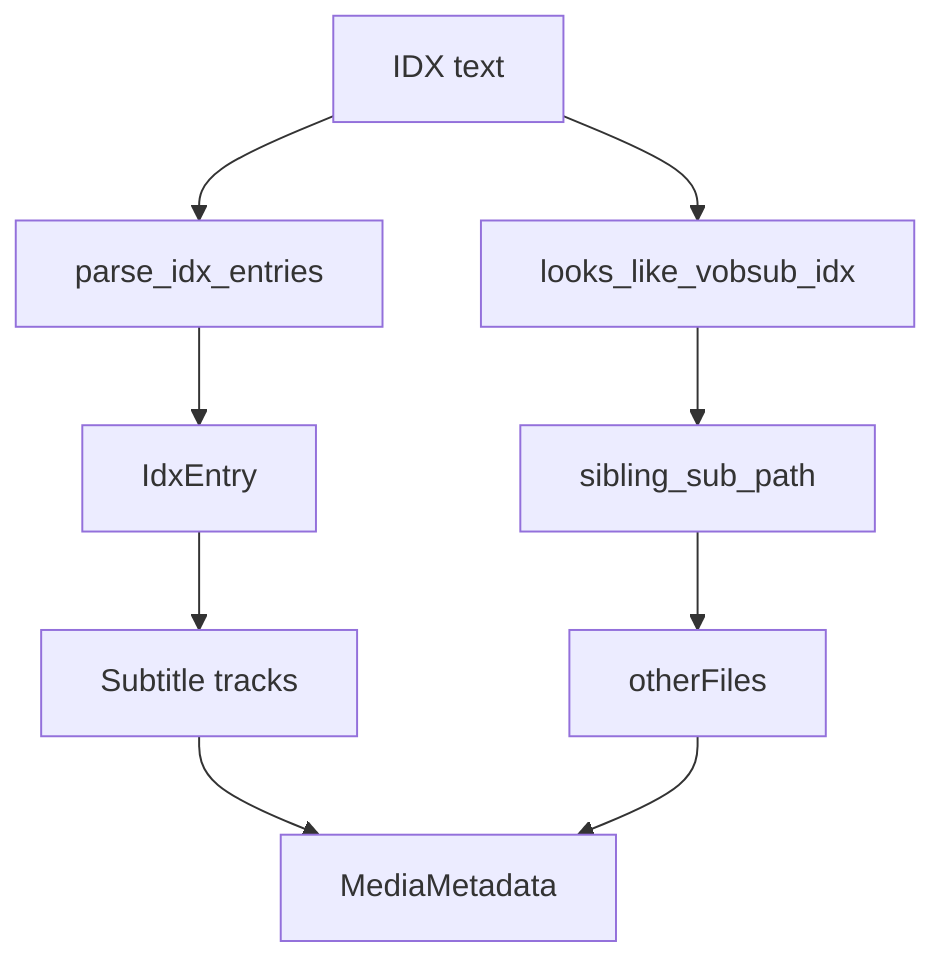

# VobSub IDX Parser

Implementation progress: 58%

## Purpose

The VobSub parser recognises `.idx` manifests, records the sibling `.sub` file when present, and reports one image subtitle track per language entry.

## Implementation

- Primary implementation: `src-tauri/src/media_metadata/subtitles/vobsub.rs`
- Upstream basis: `../mkvtoolnix/src/input/r_vobsub.cpp`, `../mkvtoolnix/src/input/r_vobsub.h`, `../mkvtoolnix/src/common/vobsub.cpp`, `../mkvtoolnix/src/common/vobsub.h`

The parser checks the VobSub index-file banner, parses `id: <language>, index: <n>` entries, resolves the sibling `.sub` path, records it under `container.properties.other_files`, and emits `S_VOBSUB` tracks.

## Data Structures

`IdxEntry` stores language, index, and title/name information parsed from the manifest.

## Gaps and Handling

Rust does not open a `.sub` file and then discover the sibling `.idx`, does not require opening the `.sub` data file, and reads only a bounded manifest prefix. It parses fewer valid `id` forms and does not validate timestamp/file-position/delay sorting like upstream. Codec private currently uses the captured IDX slice rather than mkvmerge's filtered `idx_data`. This gives usable track listing but is not full VobSub muxing parity.

## Open Issues

- **PARSER-210: Normal VobSub dispatch does not resolve `.sub` inputs to the sibling `.idx`.** Native dispatch registers `VobSubReader`, whose `probe` reads the current file and checks for the IDX banner. The helper `parse_idx_at_path` can map `.sub` to `.idx`, but it is not wired into normal dispatch. mkvtoolnix probes both `.idx` and `.sub` extensions, always resolves the `.idx` path, and opens the sibling `.sub` data file during header reading.
- **PARSER-211: VobSub index parsing and codec private data differ from mkvtoolnix.** Native counts `timestamp:` lines under the current `id:` entry and stores the entire captured IDX text as codec private data. mkvtoolnix parses delay, timestamp, file position, negative timestamp handling, and out-of-order sorting, skips tracks without entries, and builds codec private data from filtered `idx_data` that omits `id`, `timestamp`, `delay`, `alt`, and `langidx` control lines.
