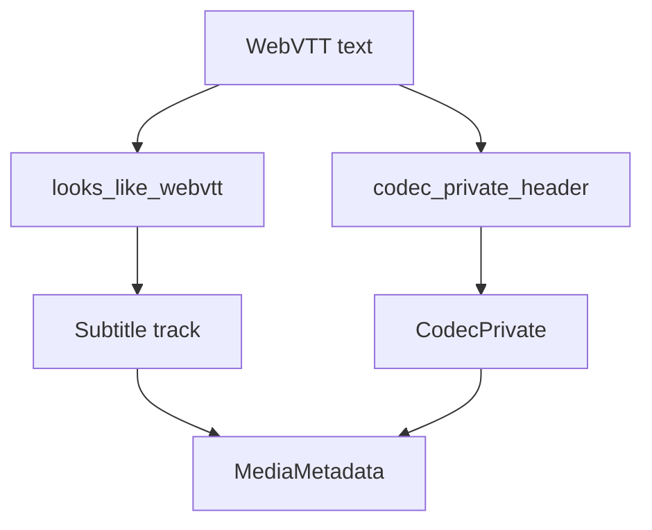

# WebVTT Parser

Implementation progress: 80%

## Purpose

The WebVTT parser recognises Web Video Text Tracks files and reports one `S_TEXT/WEBVTT` subtitle track with encoding and header codec-private metadata.

## Implementation

- Primary implementation: `src-tauri/src/media_metadata/subtitles/webvtt.rs`
- Encoding helper: `src-tauri/src/media_metadata/subtitles/encoding.rs`
- Upstream basis: `../mkvtoolnix/src/input/r_webvtt.cpp`, `../mkvtoolnix/src/input/r_webvtt.h`, `../mkvtoolnix/src/common/webvtt.*`

The reader checks for a leading `WEBVTT` signature after optional BOM handling, accepts only W3C-style separators, and preserves the cue-header region as codec private data.

## Data Structures

WebVTT uses helper functions rather than custom structs beyond shared metadata types.

## Gaps and Handling

The Rust probe is intentionally stricter than upstream's `WEBVTT` prefix check. Codec-private extraction is bounded and does not implement the complete upstream global-block parser behavior. The result is safer for false positives but can reject files mkvmerge accepts.

## Open Issues

- `PARSER-310` - WebVTT identification reports the detected source encoding. mkvtoolnix always identifies WebVTT subtitle tracks with `encoding=UTF-8`, because its WebVTT parser normalises text before packetisation. UTF-16-BOM or charset-hinted inputs can therefore produce a different metadata listing in the native parser.
