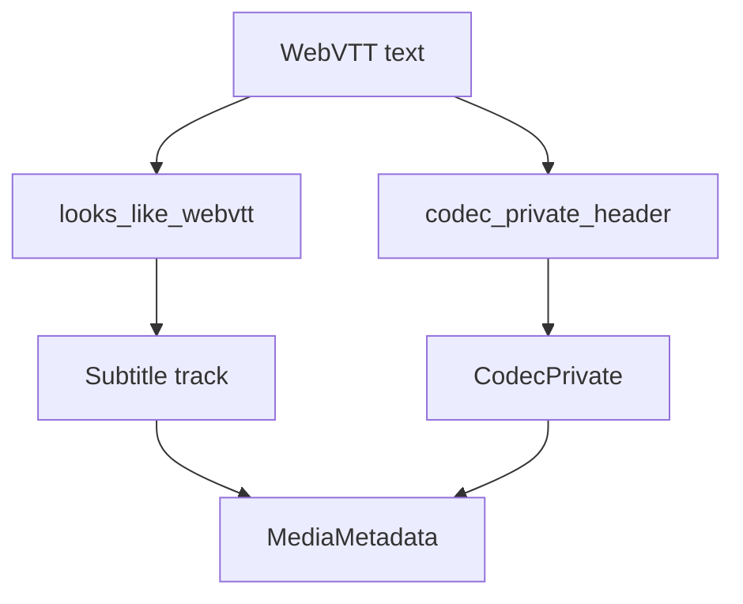

# WebVTT Parser

Implementation progress: 100%

## Purpose

The WebVTT parser recognises Web Video Text Tracks files and reports one `S_TEXT/WEBVTT` subtitle track with encoding and header codec-private metadata.

## Implementation

- Primary implementation: `src-tauri/src/media_metadata/subtitles/webvtt.rs`
- Encoding helper: `src-tauri/src/media_metadata/subtitles/encoding.rs`
- Upstream basis: `../mkvtoolnix/src/input/r_webvtt.cpp`, `../mkvtoolnix/src/input/r_webvtt.h`, `../mkvtoolnix/src/common/webvtt.*`

The reader checks whether the first decoded line starts with `WEBVTT` after optional BOM/configured-charset handling, matching mkvtoolnix's prefix probe rather than the stricter W3C separator rule. It reads the full text stream for header parsing, parses blank-line-delimited global blocks before the first cue, and preserves them as codec private data. Identification always reports the subtitle encoding as `UTF-8`, because mkvtoolnix normalises WebVTT text before packetisation even when the source file used UTF-16 or a configured charset hint.

## Data Structures

WebVTT uses helper functions rather than custom structs beyond shared metadata types.

## Gaps and Handling

Codec-private extraction follows mkvtoolnix's global-block model over the complete decoded text and reports UTF-8-normalised text subtitle metadata.
