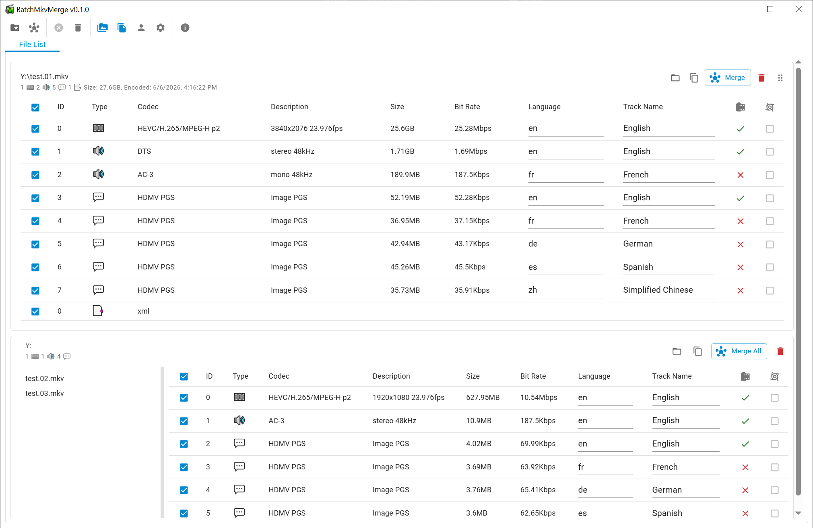
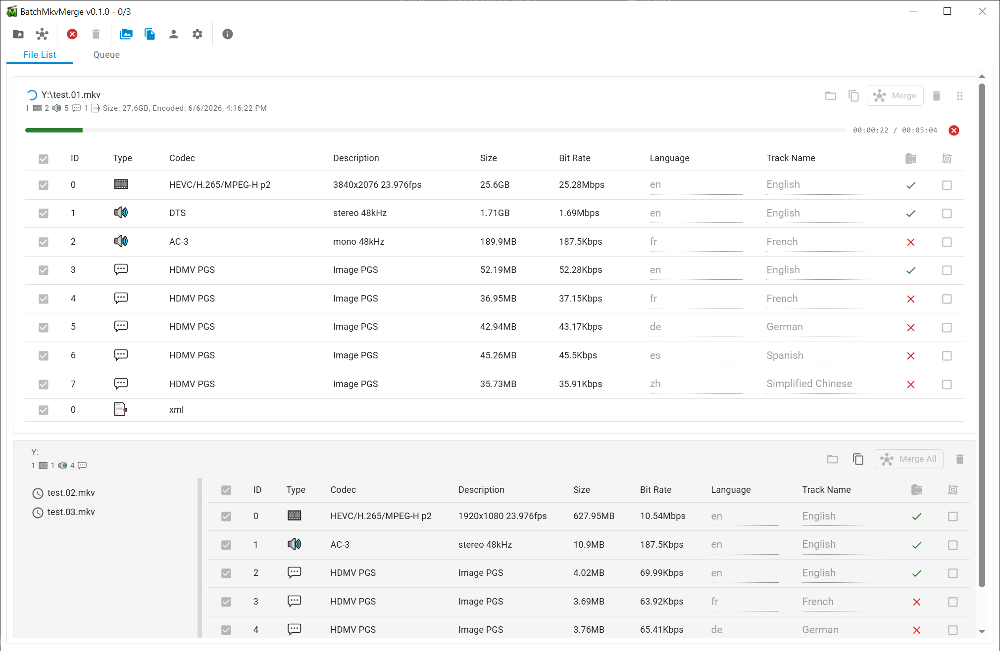
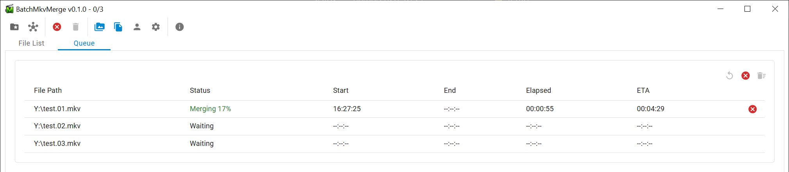
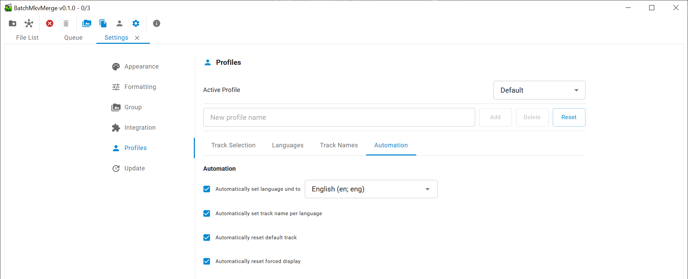

# Screenshots

This quick walkthrough uses the screenshots in this folder to show a typical merge flow from setup to execution.

## Step 1: Review cards and grouped files in File List

Return to **File List** and inspect each card:

- Top card shows one source file with all detected tracks.
- Grouped card (bottom) shows multiple files merged under one root.
- You can check/uncheck tracks, adjust language, drag and drop tracks and edit track names before starting.

Tip: Use grouped cards when episodes or parts share the same layout and you want to apply the same selection pattern quickly.

## Step 2: Start merging and watch per-card progress

After clicking **Merge** or **Merge All**, the card switches into active progress mode:

- A progress bar appears at the top of the card.
- Elapsed time and ETA are shown on the right.
- Track controls become read-only while a job is running.
- You can still cancel from the card-level cancel button.

Tip: Use this view to validate that the right file started first and ETA looks reasonable before leaving the app running.

## Step 3: Track overall job state in Queue

Open the **Queue** tab for a compact overview of all jobs:

- `Merging` rows show live percentage and timing.
- `Waiting` rows are queued and will start automatically.
- You can cancel an individual row or clean up finished entries.

Tip: Queue view is best for long batch sessions because it shows start/end/elapsed/ETA in one table.

## Step 4: Explore profile automation options

Open **Settings -> Profiles -> Automation** to see the automation features BatchMkvMerge supports:

- Set a fallback language for `und` tracks.
- Auto-assign track names based on language presets.
- Reset default and forced flags for consistent metadata behavior.

Tip: Treat this as an optional optimization step after you confirm your base merge flow works.

## Typical workflow summary

1. Drop files and verify track selections in File List.
2. Start merge from card or Merge All.
3. Monitor progress in cards or Queue until completion.
4. Optionally tune profile automation for future runs.
